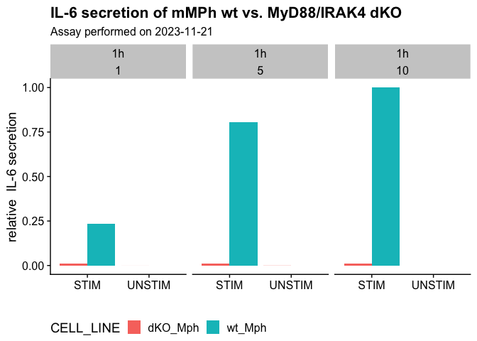
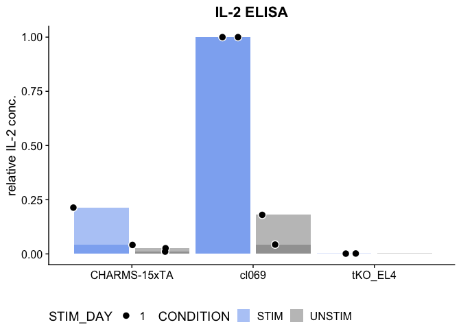
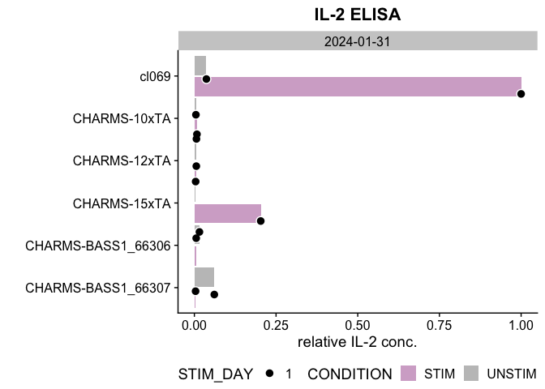
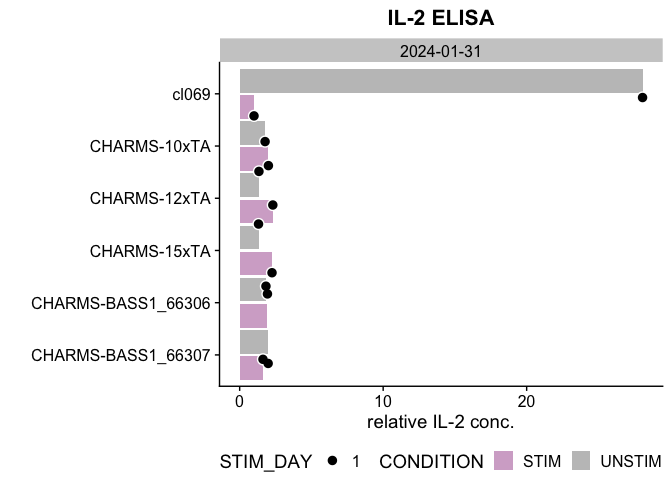
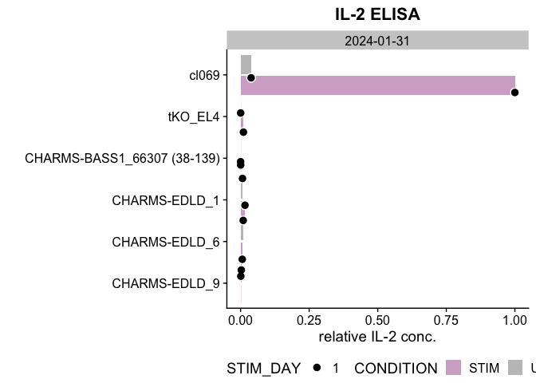
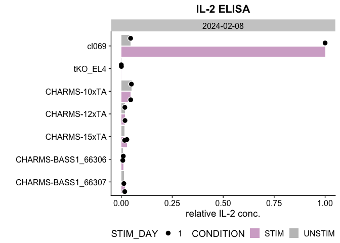

ELISA_step_by_step
================
Taylor Lab
(12 Feb 2024)

- [Notes on your raw data and how to prepare it for
  analysis](#notes-on-your-raw-data-and-how-to-prepare-it-for-analysis)
- [Loading the necessary libraries and
  packages](#loading-the-necessary-libraries-and-packages)
- [Set paths to input and output](#set-paths-to-input-and-output)
- [From raw measurements to estimated sample
  concentrations](#from-raw-measurements-to-estimated-sample-concentrations)
- [Example \#1](#example-1)

### Notes on your raw data and how to prepare it for analysis

- You need to create a folder that holds all the raw data and
  information
- Folder names should be formatted as **PLATE_n_YYYYMMDD**
- Here are several examples:


- Each plate folder should contain the following tables, either as:
  - one **Excel** file with multiple sheets (default)
  - individual **CSV** files

#### MEASUREMENTS

- provide the **raw measured values** per plate
- each plate should contain at least two standard replicates


#### CELL_LINES

- **cell line names**
- **standard curve concentrations**
- where is the **BLANK** located
- **important note:**
- We have a **[conversion
  table](https://docs.google.com/spreadsheets/d/1gjQIDVPDwxKHS3WYQZIXaAH6z-ppvPbMBUVSXbEaZ5U/edit?usp=sharing)**
  to replace the cryptic cell line numbers (e.g. *204*) with a more
  understandable name such as *Triple KO control* in all the plots (This
  will be further explained later in the script)!


#### STIM_DAYS

- **stimulation days** as numbers (e.g. 1,2,3,..)
- standards and other (unused) wells can be left **blank** or as **NA**


#### STIM_TIME

- How long did you stimulate the cells?
- Default Stimulation would be **24 hours**
- Individual experiments may vary though \<- here is the place to add
  that information!
- **EXAMPLE 1:** Standard Protocol with **24 hour stimulation**
  
- **EXAMPLE 2:** LPS-stimulated macrophages were checked **after 1 and 4
  hours**
  

#### STIM_CONCENTRATION

- How high was the stimulation concentration (ng/mL) with your stimulant
  (**IL-1ß**, **LPS**, …)?
- normal IL-1ß concentration is **5ng/mL**
- How is that calculated?
  - we dilute 2µL IL-1ß in 10mL RPMI medium (essentially 20ng/mL)
  - but since we add 50µL of this IL-1ß containing medium to 150µL
    medium with settled cells, the final concentration is 5ng/mL
- For LPS stimulations, 100ng/mL were used
- **NOTE**: only the stimulated wells are marked, the unstimulated and
  the standards can be left **blank** or as **NA**


#### CONDITIONS

- Stimulated wells –\> **STIM**
- Unstimulated wells –\> **UNSTIM**
- Wells that were used for calibration –\> **CALIBRATION**
- empty wells can be left **blank** or as **NA**


#### DILUTIONS

- Did you dilute the samples?
- The standard protocol suggests a **1:5 dilution** for all sample wells
  (control and other cell lines)
- Adjust for other dilutions as needed
- Note for ELISA assay planning:
  - dilute the **positive control 1:10** to allow all other samples more
    developing time
  - you need to stop the assay when the color reaches a high intensity
  - Measured **values ≤ 1.3** are good, anything above should be
    excluded from analysis or repeated
  - in the provided example, only the positive control (EL4) is diluted
    1:10


#### Templates

Follow along the preparation steps using one of the following
templates: - **Excel** - see
*/ELISA_step_by_step_v2_files/ELISA_TEMPLATE.xlsx* - please be aware
that these excel sheets should not contain sheets other than those
intended for analysis - one plate per excel file - sheet names should
match patterns that mark them uniquely - Please try to work with the
*ELISA_TEMPLATE.xlsx* to ensure smooth analysis

### Loading the necessary libraries and packages

``` r
library(pacman)
pacman::p_load(data.table, ggplot2, lubridate, stringr, ggpubr, dplyr, cowplot, readxl, scales, knitr)
```

### Set paths to input and output

1.  Where do you store your all of the **plate folders** containing the
    excel files?
2.  Output files will be stored in the same location!
3.  Do you want to store the created **figures** here or somewhere else?

``` r
Input_Directory <- "/Users/u_lobnow/Documents/Github/coding_universe/ALL/"
save_to         <- Input_Directory
```

4.  Add your cell line names for plots

In the lab we all know that cl204 is our triple KO cell line that lacks
MyD88/IRAK4/IRAK1. However, it is likely cryptic to other readers. In
addition, many of us use slightly different names, but mean the same
thing.. To make plots that can be published and unify all sorts of
synonyms, you may want to rename your cell lines in a reproducible
manner. For this purpose, take a look at the **ELISA_CL_KEY.csv** and
add your names!

- CELL_LINE contains the name used on the plates
- CL_NUMBER specifies the cell line number in our system
- CL_NAME_ON_PLOT is equivalent to what you want to print in figures
- PURPOSE is optional and just designates whether the cell line is used
  as a positive/negative/XYZ control or just a sample
- INFO can be used to add additional information
- PLOTTING_COLOR can be used to alter the color of your cell lines in
  the figures (not necessary, but it can add a nice touch if you wish)
- ORDER_NO is used to plot your cell lines in the correct order
  - The most important cell lines against which we compare (the positive
    controls) are ranked highly (1 for WT, 2 for cl069, 3 for 3E10)
  - Negative controls follow (order number 4 and lower)
  - Samples come last - order them as you wish (I have continuously
    numbered them - synonyms can carry the same number)

``` r
# adjust the names as needed!
NAME_KEY <- fread("/Users/u_lobnow/Documents/Github/coding_universe/ELISA_CL_KEY.csv", header = T) 
head(NAME_KEY, n = 10)
```

<div class="kable-table">

| CELL_LINE | CL_NUMBER | CL_NAME_ON_PLOT | PURPOSE | INFO | PLOTTING_COLOR | ORDER_NO |
|:----------|:----------|:----------------|:--------|:-----|:---------------|---------:|
| EL4       | cl011     | WT_EL4          | CONTROL | NA   | salmon         |        1 |
| WT        | cl011     | WT_EL4          | CONTROL | NA   | salmon         |        1 |
| WT_EL4    | cl011     | WT_EL4          | CONTROL | NA   | salmon         |        1 |
| wt_Mph    | cl051     | WT_Mph          | CONTROL | NA   | salmon         |        1 |
| 69        | cl069     | cl069           | CONTROL | NA   | salmon         |        2 |
| cl069     | cl069     | cl069           | CONTROL | NA   | salmon         |        2 |
| 3E 10     | cl028     | MyD88-GFP       | CONTROL | NA   | salmon         |        3 |
| 3E10_GFP  | cl028     | MyD88-GFP       | CONTROL | NA   | salmon         |        3 |
| MyD88-GFP | cl028     | MyD88-GFP       | CONTROL | NA   | salmon         |        3 |
| cl204     | cl204     | tKO_EL4         | CONTROL | NA   | \#37aabd       |        4 |

</div>

5.  We will need several functions to analyze the data. You do not need
    to change this.

``` r
source(file = ifelse(exists("https://raw.githubusercontent.com/tlobnow/coding_universe/main/scripts/ELISA_Fx.R"), 
                     yes =  "https://raw.githubusercontent.com/tlobnow/coding_universe/main/scripts/ELISA_Fx.R",
                     no  =  "~/Documents/Github/coding_universe/scripts/ELISA_Fx.R"))
```

### From raw measurements to estimated sample concentrations

1.  Calculate the mean values per Standard Curve dilution step
2.  Plot the Standard curve and fit a linear trend line
3.  Save the plots

We use the equation to estimate IL-2 conc. of our unknown samples

Run ELISA_Fx() to generate standard curves and calculate the IL-2
concentrations.

    ## [1] "Plates exist!"
    ## [1] "Secretion = slope*Intensity"
    ## [1] "Secretion = 313.82916069042*Intensity"

    ## [1] "Secretion = slope*Intensity"
    ## [1] "Secretion = 352.419126169057*Intensity"

    ## [1] "Secretion = slope*Intensity"
    ## [1] "Secretion = 486.430904744731*Intensity"

    ## [1] "Secretion = slope*Intensity"
    ## [1] "Secretion = 330.683712854235*Intensity"

    ## [1] "Secretion = slope*Intensity"
    ## [1] "Secretion = 320.070381583682*Intensity"

    ## [1] "Secretion = slope*Intensity"
    ## [1] "Secretion = 551.005853912264*Intensity"

    ## [1] "Secretion = slope*Intensity"
    ## [1] "Secretion = 339.16008462931*Intensity"

    ## [1] "Secretion = slope*Intensity"
    ## [1] "Secretion = 306.346853473382*Intensity"

    ## [1] "Secretion = slope*Intensity"
    ## [1] "Secretion = 512.336485628459*Intensity"

    ## [1] "Secretion = slope*Intensity"
    ## [1] "Secretion = 358.251952014523*Intensity"

    ## [1] "Secretion = slope*Intensity"
    ## [1] "Secretion = 298.804571083167*Intensity"

    ## [1] "Secretion = slope*Intensity"
    ## [1] "Secretion = 347.167928535214*Intensity"

    ## [1] "Secretion = slope*Intensity"
    ## [1] "Secretion = 559.423714931026*Intensity"

    ## [1] "Secretion = slope*Intensity"
    ## [1] "Secretion = 1158.70831902681*Intensity"

    ## [1] "Secretion = slope*Intensity"
    ## [1] "Secretion = 963.551804789211*Intensity"

    ## [1] "Secretion = slope*Intensity"
    ## [1] "Secretion = 986.272420835781*Intensity"

    ## [1] "Secretion = slope*Intensity"
    ## [1] "Secretion = 648.39257467469*Intensity"

    ## [1] "Secretion = slope*Intensity"
    ## [1] "Secretion = 1346.80312397511*Intensity"

    ## [1] "Secretion = slope*Intensity"
    ## [1] "Secretion = 343.149333875074*Intensity"

    ## [1] "Secretion = slope*Intensity"
    ## [1] "Secretion = 294.721327846507*Intensity"

    ## [1] "Secretion = slope*Intensity"
    ## [1] "Secretion = 224.743910185426*Intensity"

    ## [1] "Secretion = slope*Intensity"
    ## [1] "Secretion = 610.039946730864*Intensity"

    ## [1] "Secretion = slope*Intensity"
    ## [1] "Secretion = 560.607206139007*Intensity"

    ## [1] "Secretion = slope*Intensity"
    ## [1] "Secretion = 58.1684699766724*Intensity"

    ## [1] "Secretion = slope*Intensity"
    ## [1] "Secretion = 205.43426617438*Intensity"

    ## [1] "Secretion = slope*Intensity"
    ## [1] "Secretion = 1080.06019989381*Intensity"

    ## [1] "Secretion = slope*Intensity"
    ## [1] "Secretion = 1076.81100367551*Intensity"

    ## [1] "Secretion = slope*Intensity"
    ## [1] "Secretion = 1017.8017907237*Intensity"

    ## [1] "Secretion = slope*Intensity"
    ## [1] "Secretion = 1017.8017907237*Intensity"

    ## [1] "Secretion = slope*Intensity"
    ## [1] "Secretion = 616.472047436474*Intensity"

    ## [1] "Secretion = slope*Intensity"
    ## [1] "Secretion = 1145.90573094462*Intensity"

    ## [1] "Secretion = slope*Intensity"
    ## [1] "Secretion = 516.961651279277*Intensity"

    ## [1] "Secretion = slope*Intensity"
    ## [1] "Secretion = 248.137711921457*Intensity"

    ## [1] "Secretion = slope*Intensity"
    ## [1] "Secretion = 934.633526503215*Intensity"

    ## [1] "Secretion = slope*Intensity"
    ## [1] "Secretion = 1469.00265937138*Intensity"

    ## [1] "Secretion = slope*Intensity"
    ## [1] "Secretion = 1015.10890429452*Intensity"

    ## [1] "Secretion = slope*Intensity"
    ## [1] "Secretion = 1076.81100367551*Intensity"

    ## [1] "Secretion = slope*Intensity"
    ## [1] "Secretion = 627.707303174028*Intensity"

    ## [1] "Secretion = slope*Intensity"
    ## [1] "Secretion = 590.8221002662*Intensity"

### Example \#1

In the first example data set, we are checking the **results of the
ELISA assay**, so the entire **plate**. In order to process and plot
this data, you need to provide some information. First of all, we need
to know the Date you want to check. Supply the date as follows:
“YYYY-MM-DD”. Since we are looking at dates, the filter type must be set
to “DATE” (Below you can also find a tutorial where the filter type
differs to check for specific cell lines across several experiments).

1.  We want to filter for our **date** of interest “2022-06-09”
2.  Accordingly, we set the filter **type** to “DATE”
3.  Supply the name of your **positive control**, here “WT_EL4” - you
    can provide either plate names (CELL_LINE) or the plotting names
    (CL_NAME_ON_PLOT)
4.  Supply the name of your **negative control**, here “tKO_EL4”

``` r
# What to adjust:
FILTER_VALUES = "2022-06-09"
FILTER_TYPE   = "DATE" # or "COHORT"

POSITIVE_CTRL = c("WT_EL4")
NEGATIVE_CTRL = c("tKO_EL4", "204_TRIPLE_KO")
COLOR         = "cornflowerblue"

x_label       = ""
y_label       = "relative IL-2 conc."
plot_title    = "IL-2 ELISA"
subtitle      = paste0("Assay performed for ", FILTER_VALUES, ", based on filter type ", FILTER_TYPE)
```

<!-- -->

``` r
# What to adjust:
FILTER_VALUES = "2022-06-23"
FILTER_TYPE   = "DATE" # or "COHORT"

POSITIVE_CTRL = c("cl069")
NEGATIVE_CTRL = c("tKO_EL4", "204_TRIPLE_KO")
COLOR         = "cornflowerblue"

x_label       = ""
y_label       = "relative IL-2 conc."
plot_title    = "IL-2 ELISA"
subtitle      = paste0("Assay performed for ", FILTER_VALUES, ", based on filter type ", FILTER_TYPE)
```

<!-- -->

``` r
FILTER_VALUES = as.IDate("2024-01-31")
FILTER_TYPE   = "DATE"
POSITIVE_CTRL = c("WT_EL4", "cl069")
NEGATIVE_CTRL = c("204_TRIPLE_KO", "tKO_EL4")
x_label = ""
y_label = "relative IL-2 conc."
plot_title = "IL-2 ELISA"
subtitle = paste0("Assay performed for ", FILTER_VALUES, ", based on filter type ", FILTER_TYPE)
save = F


SEED = 1
plot_pval = T
plot_faceted_by_date = F
formatted_date <- format(as.IDate(FILTER_VALUES), "%Y%m%d")

# processing ELISA
ALL_COHORT_DATA <- lapply(FILTER_VALUES, function(FILTER_VALUE) {
  # Step 1: Filter & Subset the main data into lists
  COHORT_DATA <- filter_data(DF, FILTER_VALUE, FILTER_TYPE, POSITIVE_CTRL, NEGATIVE_CTRL)
  
  # extra filter
  COHORT_DATA <- COHORT_DATA %>% filter(Plate == 1)
  
  # Step 2 and Step 3
  NORMALIZED_DATA <- calculate_baseline_and_control(COHORT_DATA, FILTER_TYPE, POSITIVE_CTRL, NEGATIVE_CTRL)
  return(NORMALIZED_DATA)
  })
```

    ## `summarise()` has grouped output by 'Date', 'STIM_DAY'. You can override using
    ## the `.groups` argument.
    ## `summarise()` has grouped output by 'Date', 'STIM_DAY'. You can override using
    ## the `.groups` argument.

``` r
# Step 4: Combine the subset lists into one data frame
COMBINED_DATA <- bind_rows(ALL_COHORT_DATA)

# exclude a single outlier
COMBINED_DATA = COMBINED_DATA %>% filter(!(CELL_LINE == "cl069" & MEASUREMENT == 1.3965))


# Step 5: Calculate the means per cohort
MEANS <- COMBINED_DATA %>%
  group_by(CELL_LINE, CONDITION, Date, PLOTTING_COLOR) %>%
  distinct(triplicate_mean_per_day, STIM_DAY, .keep_all = TRUE) %>%
  ungroup()

# Create a data frame with unique CL_NAME_ON_PLOT and corresponding PLOTTING_COLOR
color_mapping <- unique(MEANS[, c("CL_NAME_ON_PLOT", "PLOTTING_COLOR")])

# Filter rows where CONDITION is "UNSTIM" and set PLOTTING_COLOR to "gray50"
MEANS$PLOTTING_COLOR[MEANS$CONDITION == "UNSTIM"] <- "gray50"
# MEANS$PLOTTING_COLOR[MEANS$CONDITION == "STIM"] <- "#A6529A"

# Merge the MEANS data frame with the color_mapping data frame using dplyr
MEANS_merged <- MEANS %>%
  left_join(color_mapping) %>%
  mutate(CL_NAME_ON_PLOT = factor(CL_NAME_ON_PLOT, levels = unique(MEANS$CL_NAME_ON_PLOT)))
```

    ## Joining with `by = join_by(CL_NAME_ON_PLOT, PLOTTING_COLOR)`

``` r
# Reorder CL_NAME_ON_PLOT based on ORDER_NO
MEANS_merged$CL_NAME_ON_PLOT <- reorder(MEANS$CL_NAME_ON_PLOT, -MEANS_merged$ORDER_NO)
MEANS_merged$STIM_DAY <- as.factor(MEANS_merged$STIM_DAY)
  
# Step 6: Calculate the mean of means (MOM) per cohort
MOM_SUBSET <- MEANS_merged %>%
  group_by(CELL_LINE, CL_NAME_ON_PLOT, CONDITION, Date, PLOTTING_COLOR, ORDER_NO) %>%
  summarise(triplicate_sd_per_day = sd(triplicate_mean_per_day),
            triplicate_mean_per_day = mean(triplicate_mean_per_day)) %>%
  distinct(.keep_all = TRUE)
```

    ## `summarise()` has grouped output by 'CELL_LINE', 'CL_NAME_ON_PLOT',
    ## 'CONDITION', 'Date', 'PLOTTING_COLOR'. You can override using the `.groups`
    ## argument.

``` r
# Step 7: Perform statistics per cohort
STATISTICAL_RESULTS <- perform_statistical_analysis(MEANS_merged, "CL_NAME_ON_PLOT")

# Your ggplot code
my_plot <- ggplot(MEANS_merged, aes(x = CL_NAME_ON_PLOT)) +
  geom_col(data = MOM_SUBSET,
           aes(y = triplicate_mean_per_day, fill = CONDITION), 
           position = position_dodge(width = 1),
           alpha = 0.5) +
  geom_point(data = MEANS_merged,
             aes(y = triplicate_mean_per_day, group = CONDITION, shape = STIM_DAY),
             position = position_jitterdodge(jitter.height = 0, jitter.width = 1.2, seed = SEED),
             col = "white", size = 4) +
  geom_point(data = MEANS_merged, aes(y = triplicate_mean_per_day, group = CONDITION, shape = STIM_DAY),
             position = position_jitterdodge(jitter.height = 0, jitter.width = 1.2, seed = SEED),
             col = "black", size = 3) +
  geom_errorbar(data = MOM_SUBSET, aes(ymin = triplicate_mean_per_day - triplicate_sd_per_day,
                                       ymax = triplicate_mean_per_day + triplicate_sd_per_day, group = CONDITION),
                width = 0.25, position = position_dodge(width = 1)) +
  labs(x = x_label,
       y = y_label) +
  scale_fill_manual(values = c("UNSTIM" = "gray50", "STIM" = "#A6529A")) +
  ggtitle(plot_title) +
  theme_cowplot() +
  theme(legend.position = "bottom") +
  theme(plot.title = element_text(hjust = 0.5)) +
  coord_flip() +
  facet_wrap(~Date)

my_plot
```

<!-- -->

``` r
if (save) {
  # Step 9: Create Output Folder
  folder_path <- file.path(save_to, paste0("Plate_1_", formatted_date))
  if (!dir.exists(folder_path)) {dir.create(folder_path, recursive = TRUE)}   # Check if the folder exists, and if not, create it
  
  # Step 10: Save Plots and Data
  save_plots(folder_name = basename(folder_path), plots = list(my_plot))
  fwrite(COMBINED_DATA,       file = paste0(folder_path, "/COMBINED_DATA.csv"),       append = F, quote = F, row.names = F, col.names = T)
  fwrite(MEANS,               file = paste0(folder_path, "/MEANS.csv"),               append = F, quote = F, row.names = F, col.names = T)
  fwrite(MOM_SUBSET,          file = paste0(folder_path, "/MOM_SUBSET.csv"),          append = F, quote = F, row.names = F, col.names = T)
  fwrite(STATISTICAL_RESULTS, file = paste0(folder_path, "/STATISTICAL_RESULTS.csv"), append = F, quote = F, row.names = F, col.names = T)
}
```

``` r
FILTER_VALUES = as.IDate("2024-01-31")
FILTER_TYPE   = "DATE"
POSITIVE_CTRL = c("WT_EL4", "cl069")
NEGATIVE_CTRL = c("204_TRIPLE_KO", "tKO_EL4")
x_label = ""
y_label = "relative IL-2 conc."
plot_title = "IL-2 ELISA"
subtitle = paste0("Assay performed for ", FILTER_VALUES, ", based on filter type ", FILTER_TYPE)
save = F


SEED = 1
plot_pval = T
plot_faceted_by_date = F
formatted_date <- format(as.IDate(FILTER_VALUES), "%Y%m%d")

# processing ELISA
ALL_COHORT_DATA <- lapply(FILTER_VALUES, function(FILTER_VALUE) {
  # Step 1: Filter & Subset the main data into lists
  COHORT_DATA <- filter_data(DF, FILTER_VALUE, FILTER_TYPE, POSITIVE_CTRL, NEGATIVE_CTRL)
  
  # extra filter
  COHORT_DATA <- COHORT_DATA %>% filter(Plate == 2)
  
  # Step 2 and Step 3
  NORMALIZED_DATA <- calculate_baseline_and_control(COHORT_DATA, FILTER_TYPE, POSITIVE_CTRL, NEGATIVE_CTRL)
  return(NORMALIZED_DATA)
  })
```

    ## `summarise()` has grouped output by 'Date', 'STIM_DAY'. You can override using
    ## the `.groups` argument.
    ## `summarise()` has grouped output by 'Date', 'STIM_DAY'. You can override using
    ## the `.groups` argument.

``` r
# Step 4: Combine the subset lists into one data frame
COMBINED_DATA <- bind_rows(ALL_COHORT_DATA)

# exclude a single outlier
COMBINED_DATA = COMBINED_DATA %>% filter(!(CELL_LINE == "cl069" & MEASUREMENT == 1.3965))


# Step 5: Calculate the means per cohort
MEANS <- COMBINED_DATA %>%
  group_by(CELL_LINE, CONDITION, Date, PLOTTING_COLOR) %>%
  distinct(triplicate_mean_per_day, STIM_DAY, .keep_all = TRUE) %>%
  ungroup()

# Create a data frame with unique CL_NAME_ON_PLOT and corresponding PLOTTING_COLOR
color_mapping <- unique(MEANS[, c("CL_NAME_ON_PLOT", "PLOTTING_COLOR")])

# Filter rows where CONDITION is "UNSTIM" and set PLOTTING_COLOR to "gray50"
MEANS$PLOTTING_COLOR[MEANS$CONDITION == "UNSTIM"] <- "gray50"
# MEANS$PLOTTING_COLOR[MEANS$CONDITION == "STIM"] <- "#A6529A"

# Merge the MEANS data frame with the color_mapping data frame using dplyr
MEANS_merged <- MEANS %>%
  left_join(color_mapping) %>%
  mutate(CL_NAME_ON_PLOT = factor(CL_NAME_ON_PLOT, levels = unique(MEANS$CL_NAME_ON_PLOT)))
```

    ## Joining with `by = join_by(CL_NAME_ON_PLOT, PLOTTING_COLOR)`

``` r
# Reorder CL_NAME_ON_PLOT based on ORDER_NO
MEANS_merged$CL_NAME_ON_PLOT <- reorder(MEANS$CL_NAME_ON_PLOT, -MEANS_merged$ORDER_NO)
MEANS_merged$STIM_DAY <- as.factor(MEANS_merged$STIM_DAY)
  
# Step 6: Calculate the mean of means (MOM) per cohort
MOM_SUBSET <- MEANS_merged %>%
  group_by(CELL_LINE, CL_NAME_ON_PLOT, CONDITION, Date, PLOTTING_COLOR, ORDER_NO) %>%
  summarise(triplicate_sd_per_day = sd(triplicate_mean_per_day),
            triplicate_mean_per_day = mean(triplicate_mean_per_day)) %>%
  distinct(.keep_all = TRUE)
```

    ## `summarise()` has grouped output by 'CELL_LINE', 'CL_NAME_ON_PLOT',
    ## 'CONDITION', 'Date', 'PLOTTING_COLOR'. You can override using the `.groups`
    ## argument.

``` r
# Step 7: Perform statistics per cohort
STATISTICAL_RESULTS <- perform_statistical_analysis(MEANS_merged, "CL_NAME_ON_PLOT")

# Your ggplot code
my_plot <- ggplot(MEANS_merged, aes(x = CL_NAME_ON_PLOT)) +
  geom_col(data = MOM_SUBSET,
           aes(y = triplicate_mean_per_day, fill = CONDITION), 
           position = position_dodge(width = 1),
           alpha = 0.5) +
  geom_point(data = MEANS_merged,
             aes(y = triplicate_mean_per_day, group = CONDITION, shape = STIM_DAY),
             position = position_jitterdodge(jitter.height = 0, jitter.width = 1.2, seed = SEED),
             col = "white", size = 4) +
  geom_point(data = MEANS_merged, aes(y = triplicate_mean_per_day, group = CONDITION, shape = STIM_DAY),
             position = position_jitterdodge(jitter.height = 0, jitter.width = 1.2, seed = SEED),
             col = "black", size = 3) +
  geom_errorbar(data = MOM_SUBSET, aes(ymin = triplicate_mean_per_day - triplicate_sd_per_day,
                                       ymax = triplicate_mean_per_day + triplicate_sd_per_day, group = CONDITION),
                width = 0.25, position = position_dodge(width = 1)) +
  labs(x = x_label,
       y = y_label) +
  scale_fill_manual(values = c("UNSTIM" = "gray50", "STIM" = "#A6529A")) +
  ggtitle(plot_title) +
  theme_cowplot() +
  theme(legend.position = "bottom") +
  theme(plot.title = element_text(hjust = 0.5)) +
  coord_flip() +
  facet_wrap(~Date)

my_plot
```

<!-- -->

``` r
if (save) {
  # Step 9: Create Output Folder
  folder_path <- file.path(save_to, paste0("Plate_2_", formatted_date))
  if (!dir.exists(folder_path)) {dir.create(folder_path, recursive = TRUE)}   # Check if the folder exists, and if not, create it
  
  # Step 10: Save Plots and Data
  save_plots(folder_name = basename(folder_path), plots = list(my_plot))
  fwrite(COMBINED_DATA,       file = paste0(folder_path, "/COMBINED_DATA.csv"),       append = F, quote = F, row.names = F, col.names = T)
  fwrite(MEANS,               file = paste0(folder_path, "/MEANS.csv"),               append = F, quote = F, row.names = F, col.names = T)
  fwrite(MOM_SUBSET,          file = paste0(folder_path, "/MOM_SUBSET.csv"),          append = F, quote = F, row.names = F, col.names = T)
  fwrite(STATISTICAL_RESULTS, file = paste0(folder_path, "/STATISTICAL_RESULTS.csv"), append = F, quote = F, row.names = F, col.names = T)
}
```

``` r
FILTER_VALUES = as.IDate("2024-01-31")
FILTER_TYPE   = "DATE"
POSITIVE_CTRL = c("WT_EL4", "cl069")
NEGATIVE_CTRL = c("204_TRIPLE_KO", "tKO_EL4")
x_label = ""
y_label = "relative IL-2 conc."
plot_title = "IL-2 ELISA"
subtitle = paste0("Assay performed for ", FILTER_VALUES, ", based on filter type ", FILTER_TYPE)
save = F


SEED = 1
plot_pval = T
plot_faceted_by_date = F
formatted_date <- format(as.IDate(FILTER_VALUES), "%Y%m%d")

# processing ELISA
ALL_COHORT_DATA <- lapply(FILTER_VALUES, function(FILTER_VALUE) {
  # Step 1: Filter & Subset the main data into lists
  COHORT_DATA <- filter_data(DF, FILTER_VALUE, FILTER_TYPE, POSITIVE_CTRL, NEGATIVE_CTRL)
  
  # extra filter
  COHORT_DATA <- COHORT_DATA %>% filter(Plate == 3)
  
  # Step 2 and Step 3
  NORMALIZED_DATA <- calculate_baseline_and_control(COHORT_DATA, FILTER_TYPE, POSITIVE_CTRL, NEGATIVE_CTRL)
  return(NORMALIZED_DATA)
  })
```

    ## `summarise()` has grouped output by 'Date', 'STIM_DAY'. You can override using
    ## the `.groups` argument.
    ## `summarise()` has grouped output by 'Date', 'STIM_DAY'. You can override using
    ## the `.groups` argument.

``` r
# Step 4: Combine the subset lists into one data frame
COMBINED_DATA <- bind_rows(ALL_COHORT_DATA)

# exclude a single outlier
COMBINED_DATA = COMBINED_DATA %>% filter(!(CELL_LINE == "cl069" & MEASUREMENT == 1.3965))


# Step 5: Calculate the means per cohort
MEANS <- COMBINED_DATA %>%
  group_by(CELL_LINE, CONDITION, Date, PLOTTING_COLOR) %>%
  distinct(triplicate_mean_per_day, STIM_DAY, .keep_all = TRUE) %>%
  ungroup()

# Create a data frame with unique CL_NAME_ON_PLOT and corresponding PLOTTING_COLOR
color_mapping <- unique(MEANS[, c("CL_NAME_ON_PLOT", "PLOTTING_COLOR")])

# Filter rows where CONDITION is "UNSTIM" and set PLOTTING_COLOR to "gray50"
MEANS$PLOTTING_COLOR[MEANS$CONDITION == "UNSTIM"] <- "gray50"
# MEANS$PLOTTING_COLOR[MEANS$CONDITION == "STIM"] <- "#A6529A"

# Merge the MEANS data frame with the color_mapping data frame using dplyr
MEANS_merged <- MEANS %>%
  left_join(color_mapping) %>%
  mutate(CL_NAME_ON_PLOT = factor(CL_NAME_ON_PLOT, levels = unique(MEANS$CL_NAME_ON_PLOT)))
```

    ## Joining with `by = join_by(CL_NAME_ON_PLOT, PLOTTING_COLOR)`

``` r
# Reorder CL_NAME_ON_PLOT based on ORDER_NO
MEANS_merged$CL_NAME_ON_PLOT <- reorder(MEANS$CL_NAME_ON_PLOT, -MEANS_merged$ORDER_NO)
MEANS_merged$STIM_DAY <- as.factor(MEANS_merged$STIM_DAY)
  
# Step 6: Calculate the mean of means (MOM) per cohort
MOM_SUBSET <- MEANS_merged %>%
  group_by(CELL_LINE, CL_NAME_ON_PLOT, CONDITION, Date, PLOTTING_COLOR, ORDER_NO) %>%
  summarise(triplicate_sd_per_day = sd(triplicate_mean_per_day),
            triplicate_mean_per_day = mean(triplicate_mean_per_day)) %>%
  distinct(.keep_all = TRUE)
```

    ## `summarise()` has grouped output by 'CELL_LINE', 'CL_NAME_ON_PLOT',
    ## 'CONDITION', 'Date', 'PLOTTING_COLOR'. You can override using the `.groups`
    ## argument.

``` r
# Step 7: Perform statistics per cohort
STATISTICAL_RESULTS <- perform_statistical_analysis(MEANS_merged, "CL_NAME_ON_PLOT")

# Your ggplot code
my_plot <- ggplot(MEANS_merged, aes(x = CL_NAME_ON_PLOT)) +
  geom_col(data = MOM_SUBSET,
           aes(y = triplicate_mean_per_day, fill = CONDITION), 
           position = position_dodge(width = 1),
           alpha = 0.5) +
  geom_point(data = MEANS_merged,
             aes(y = triplicate_mean_per_day, group = CONDITION, shape = STIM_DAY),
             position = position_jitterdodge(jitter.height = 0, jitter.width = 1.2, seed = SEED),
             col = "white", size = 4) +
  geom_point(data = MEANS_merged, aes(y = triplicate_mean_per_day, group = CONDITION, shape = STIM_DAY),
             position = position_jitterdodge(jitter.height = 0, jitter.width = 1.2, seed = SEED),
             col = "black", size = 3) +
  geom_errorbar(data = MOM_SUBSET, aes(ymin = triplicate_mean_per_day - triplicate_sd_per_day,
                                       ymax = triplicate_mean_per_day + triplicate_sd_per_day, group = CONDITION),
                width = 0.25, position = position_dodge(width = 1)) +
  labs(x = x_label,
       y = y_label) +
  scale_fill_manual(values = c("UNSTIM" = "gray50", "STIM" = "#A6529A")) +
  ggtitle(plot_title) +
  theme_cowplot() +
  theme(legend.position = "bottom") +
  theme(plot.title = element_text(hjust = 0.5)) +
  coord_flip() +
  facet_wrap(~Date)

my_plot
```

<!-- -->

``` r
if (save) {
  # Step 9: Create Output Folder
  folder_path <- file.path(save_to, paste0("Plate_3_", formatted_date))
  if (!dir.exists(folder_path)) {dir.create(folder_path, recursive = TRUE)}   # Check if the folder exists, and if not, create it
  
  # Step 10: Save Plots and Data
  save_plots(folder_name = basename(folder_path), plots = list(my_plot))
  fwrite(COMBINED_DATA,       file = paste0(folder_path, "/COMBINED_DATA.csv"),       append = F, quote = F, row.names = F, col.names = T)
  fwrite(MEANS,               file = paste0(folder_path, "/MEANS.csv"),               append = F, quote = F, row.names = F, col.names = T)
  fwrite(MOM_SUBSET,          file = paste0(folder_path, "/MOM_SUBSET.csv"),          append = F, quote = F, row.names = F, col.names = T)
  fwrite(STATISTICAL_RESULTS, file = paste0(folder_path, "/STATISTICAL_RESULTS.csv"), append = F, quote = F, row.names = F, col.names = T)
}
```

``` r
FILTER_VALUES = as.IDate("2024-02-08")
FILTER_TYPE   = "DATE"
POSITIVE_CTRL = c("WT_EL4", "cl069")
NEGATIVE_CTRL = c("204_TRIPLE_KO", "tKO_EL4")
x_label = ""
y_label = "relative IL-2 conc."
plot_title = "IL-2 ELISA"
subtitle = paste0("Assay performed for ", FILTER_VALUES, ", based on filter type ", FILTER_TYPE)
save = F


SEED = 1
plot_pval = T
plot_faceted_by_date = F
formatted_date <- format(as.IDate(FILTER_VALUES), "%Y%m%d")

# processing ELISA
ALL_COHORT_DATA <- lapply(FILTER_VALUES, function(FILTER_VALUE) {
  # Step 1: Filter & Subset the main data into lists
  COHORT_DATA <- filter_data(DF, FILTER_VALUE, FILTER_TYPE, POSITIVE_CTRL, NEGATIVE_CTRL)
  
  # extra filter
  COHORT_DATA <- COHORT_DATA %>% filter(Plate == 1)
  
  # Step 2 and Step 3
  NORMALIZED_DATA <- calculate_baseline_and_control(COHORT_DATA, FILTER_TYPE, POSITIVE_CTRL, NEGATIVE_CTRL)
  return(NORMALIZED_DATA)
  })
```

    ## `summarise()` has grouped output by 'Date', 'STIM_DAY'. You can override using
    ## the `.groups` argument.
    ## `summarise()` has grouped output by 'Date', 'STIM_DAY'. You can override using
    ## the `.groups` argument.

``` r
# Step 4: Combine the subset lists into one data frame
COMBINED_DATA <- bind_rows(ALL_COHORT_DATA)

# exclude a single outlier
COMBINED_DATA = COMBINED_DATA %>% filter(!(CELL_LINE == "cl069" & MEASUREMENT == 1.3965))


# Step 5: Calculate the means per cohort
MEANS <- COMBINED_DATA %>%
  group_by(CELL_LINE, CONDITION, Date, PLOTTING_COLOR) %>%
  distinct(triplicate_mean_per_day, STIM_DAY, .keep_all = TRUE) %>%
  ungroup()

# Create a data frame with unique CL_NAME_ON_PLOT and corresponding PLOTTING_COLOR
color_mapping <- unique(MEANS[, c("CL_NAME_ON_PLOT", "PLOTTING_COLOR")])

# Filter rows where CONDITION is "UNSTIM" and set PLOTTING_COLOR to "gray50"
MEANS$PLOTTING_COLOR[MEANS$CONDITION == "UNSTIM"] <- "gray50"
# MEANS$PLOTTING_COLOR[MEANS$CONDITION == "STIM"] <- "#A6529A"

# Merge the MEANS data frame with the color_mapping data frame using dplyr
MEANS_merged <- MEANS %>%
  left_join(color_mapping) %>%
  mutate(CL_NAME_ON_PLOT = factor(CL_NAME_ON_PLOT, levels = unique(MEANS$CL_NAME_ON_PLOT)))
```

    ## Joining with `by = join_by(CL_NAME_ON_PLOT, PLOTTING_COLOR)`

``` r
# Reorder CL_NAME_ON_PLOT based on ORDER_NO
MEANS_merged$CL_NAME_ON_PLOT <- reorder(MEANS$CL_NAME_ON_PLOT, -MEANS_merged$ORDER_NO)
MEANS_merged$STIM_DAY <- as.factor(MEANS_merged$STIM_DAY)
  
# Step 6: Calculate the mean of means (MOM) per cohort
MOM_SUBSET <- MEANS_merged %>%
  group_by(CELL_LINE, CL_NAME_ON_PLOT, CONDITION, Date, PLOTTING_COLOR, ORDER_NO) %>%
  summarise(triplicate_sd_per_day = sd(triplicate_mean_per_day),
            triplicate_mean_per_day = mean(triplicate_mean_per_day)) %>%
  distinct(.keep_all = TRUE)
```

    ## `summarise()` has grouped output by 'CELL_LINE', 'CL_NAME_ON_PLOT',
    ## 'CONDITION', 'Date', 'PLOTTING_COLOR'. You can override using the `.groups`
    ## argument.

``` r
# Step 7: Perform statistics per cohort
STATISTICAL_RESULTS <- perform_statistical_analysis(MEANS_merged, "CL_NAME_ON_PLOT")

# Your ggplot code
my_plot <- ggplot(MEANS_merged, aes(x = CL_NAME_ON_PLOT)) +
  geom_col(data = MOM_SUBSET,
           aes(y = triplicate_mean_per_day, fill = CONDITION), 
           position = position_dodge(width = 1),
           alpha = 0.5) +
  geom_point(data = MEANS_merged,
             aes(y = triplicate_mean_per_day, group = CONDITION, shape = STIM_DAY),
             position = position_jitterdodge(jitter.height = 0, jitter.width = 1.2, seed = SEED),
             col = "white", size = 4) +
  geom_point(data = MEANS_merged, aes(y = triplicate_mean_per_day, group = CONDITION, shape = STIM_DAY),
             position = position_jitterdodge(jitter.height = 0, jitter.width = 1.2, seed = SEED),
             col = "black", size = 3) +
  geom_errorbar(data = MOM_SUBSET, aes(ymin = triplicate_mean_per_day - triplicate_sd_per_day,
                                       ymax = triplicate_mean_per_day + triplicate_sd_per_day, group = CONDITION),
                width = 0.25, position = position_dodge(width = 1)) +
  labs(x = x_label,
       y = y_label) +
  scale_fill_manual(values = c("UNSTIM" = "gray50", "STIM" = "#A6529A")) +
  ggtitle(plot_title) +
  theme_cowplot() +
  theme(legend.position = "bottom") +
  theme(plot.title = element_text(hjust = 0.5)) +
  coord_flip() +
  facet_wrap(~Date)

my_plot
```

<!-- -->

``` r
if (save) {
  # Step 9: Create Output Folder
  folder_path <- file.path(save_to, paste0("Plate_1_", formatted_date))
  if (!dir.exists(folder_path)) {dir.create(folder_path, recursive = TRUE)}   # Check if the folder exists, and if not, create it
  
  # Step 10: Save Plots and Data
  save_plots(folder_name = basename(folder_path), plots = list(my_plot))
  fwrite(COMBINED_DATA,       file = paste0(folder_path, "/COMBINED_DATA.csv"),       append = F, quote = F, row.names = F, col.names = T)
  fwrite(MEANS,               file = paste0(folder_path, "/MEANS.csv"),               append = F, quote = F, row.names = F, col.names = T)
  fwrite(MOM_SUBSET,          file = paste0(folder_path, "/MOM_SUBSET.csv"),          append = F, quote = F, row.names = F, col.names = T)
  fwrite(STATISTICAL_RESULTS, file = paste0(folder_path, "/STATISTICAL_RESULTS.csv"), append = F, quote = F, row.names = F, col.names = T)
}
```
