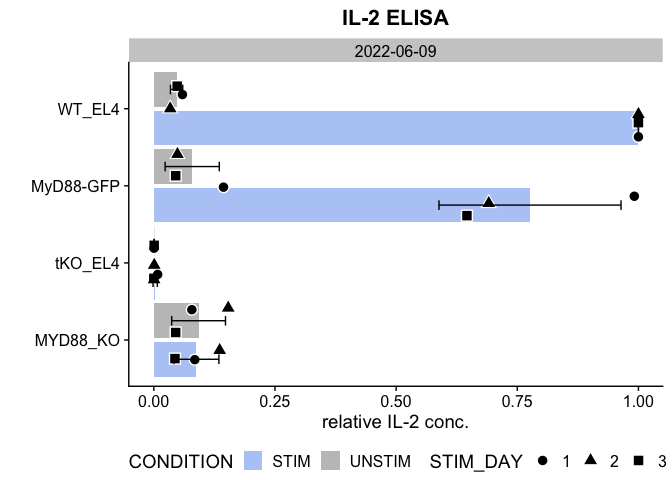

Step by Step Analysis
================
Taylor Lab
(12 Feb 2024)

- [Loading the necessary libraries and
  packages](#loading-the-necessary-libraries-and-packages)
- [Set paths to input and output](#set-paths-to-input-and-output)
- [From raw measurements to estimated sample
  concentrations](#from-raw-measurements-to-estimated-sample-concentrations)
- [Example \#1](#example-1)

### Loading the necessary libraries and packages

``` r
library(pacman)
pacman::p_load(data.table, ggplot2, lubridate, stringr, ggpubr, dplyr, cowplot, readxl, scales, knitr)
```

### Set paths to input and output

1.  Where do you store your all of the **plate folders** containing the
    excel files?
2.  Output files will be stored in the same location!
3.  Do you want to store the created **figures** here or somewhere else?

``` r
Input_Directory <- "./ALL/"
save_to         <- Input_Directory
```

4.  Add your cell line names for plots

In the lab we all know that cl204 is our triple KO cell line that lacks
MyD88/IRAK4/IRAK1. However, it is likely cryptic to other readers. In
addition, many of us use slightly different names, but mean the same
thing.. To make plots that can be published and unify all sorts of
synonyms, you may want to rename your cell lines in a reproducible
manner. For this purpose, take a look at the **ELISA_CL_KEY.csv** and
add your names!

- CELL_LINE contains the name used on the plates
- CL_NUMBER specifies the cell line number in our system
- CL_NAME_ON_PLOT is equivalent to what you want to print in figures
- PURPOSE is optional and just designates whether the cell line is used
  as a positive/negative/XYZ control or just a sample
- INFO can be used to add additional information
- PLOTTING_COLOR can be used to alter the color of your cell lines in
  the figures (not necessary, but it can add a nice touch if you wish)
- ORDER_NO is used to plot your cell lines in the correct order
- The most important cell lines against which we compare (the positive
  controls) are ranked highly (1 for WT, 2 for cl069, 3 for 3E10)
- Negative controls follow (order number 4 and lower)
- Samples come last - order them as you wish (I have continuously
  numbered them - synonyms can carry the same number)

``` r
# adjust the names as needed!
NAME_KEY <- fread("./ELISA_CL_KEY.csv", header = T) 
head(NAME_KEY, n = 10)
```

<div class="kable-table">

| CELL_LINE | CL_NUMBER | CL_NAME_ON_PLOT | PURPOSE | INFO | PLOTTING_COLOR | ORDER_NO |
|:----------|:----------|:----------------|:--------|:-----|:---------------|---------:|
| EL4       | cl011     | WT_EL4          | CONTROL | NA   | salmon         |        1 |
| WT        | cl011     | WT_EL4          | CONTROL | NA   | salmon         |        1 |
| WT_EL4    | cl011     | WT_EL4          | CONTROL | NA   | salmon         |        1 |
| wt_Mph    | cl051     | WT_Mph          | CONTROL | NA   | salmon         |        1 |
| 69        | cl069     | cl069           | CONTROL | NA   | salmon         |        2 |
| cl069     | cl069     | cl069           | CONTROL | NA   | salmon         |        2 |
| 3E 10     | cl028     | MyD88-GFP       | CONTROL | NA   | salmon         |        3 |
| 3E10_GFP  | cl028     | MyD88-GFP       | CONTROL | NA   | salmon         |        3 |
| MyD88-GFP | cl028     | MyD88-GFP       | CONTROL | NA   | salmon         |        3 |
| cl204     | cl204     | tKO_EL4         | CONTROL | NA   | \#37aabd       |        4 |

</div>

5.  We will need several functions to analyze the data. You do not need
    to change this.

``` r
source(file = ifelse(exists("https://raw.githubusercontent.com/tlobnow/coding_universe/main/scripts/ELISA_Fx.R"), 
                     yes =  "https://raw.githubusercontent.com/tlobnow/coding_universe/main/scripts/ELISA_Fx.R",
                     no  =  "./scripts/ELISA_Fx.R"))
```

### From raw measurements to estimated sample concentrations

1.  Calculate the mean values per Standard Curve dilution step
2.  Plot the Standard curve and fit a linear trend line
3.  Save the plots

We use the equation to estimate IL-2 conc. of our unknown samples

Run ELISA_Fx() to generate standard curves and calculate the IL-2
concentrations.

    ## [1] "Plates exist!"
    ## [1] "Secretion = slope*Intensity"
    ## [1] "Secretion = 559.423714931026*Intensity"

    ## [1] "Secretion = slope*Intensity"
    ## [1] "Secretion = 1080.06019989381*Intensity"

    ## [1] "Secretion = slope*Intensity"
    ## [1] "Secretion = 1076.81100367551*Intensity"

    ## [1] "Secretion = slope*Intensity"
    ## [1] "Secretion = 659.569606790955*Intensity"

    ## [1] "Secretion = slope*Intensity"
    ## [1] "Secretion = 1015.10890429452*Intensity"

    ## [1] "Secretion = slope*Intensity"
    ## [1] "Secretion = 1076.81100367551*Intensity"

    ## [1] "Secretion = slope*Intensity"
    ## [1] "Secretion = 590.8221002662*Intensity"

### Example \#1

In the first example data set, we are checking the **results of the
ELISA assay**, so the entire **plate**. In order to process and plot
this data, you need to provide some information. First of all, we need
to know the Date you want to check. Supply the date as follows:
“YYYY-MM-DD”. Since we are looking at dates, the filter type must be set
to “DATE” (Below you can also find a tutorial where the filter type
differs to check for specific cell lines across several experiments).

1.  We want to filter for our **date** of interest “2022-06-09”
2.  Accordingly, we set the filter **type** to “DATE”
3.  Supply the name of your **positive control**, here “WT_EL4” - you
    can provide either plate names (CELL_LINE) or the plotting names
    (CL_NAME_ON_PLOT)
4.  Supply the name of your **negative control**, here “tKO_EL4”

<!-- -->
