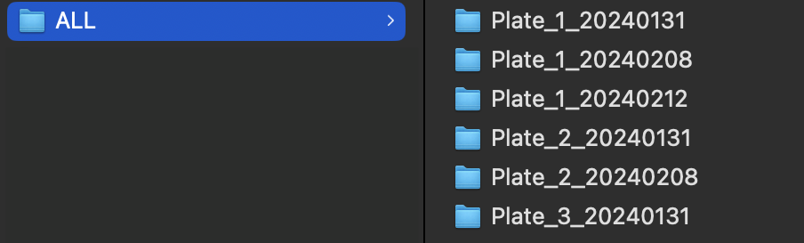

ELISA_PREP
================
Taylor Lab
(12 Feb 2024)

- [Notes on Folder Organization](#notes-on-folder-organization)

### Notes on Folder Organization

- You need to create a folder that holds all the raw data and
  information per plate
- Folder names should be formatted as **PLATE_n_YYYYMMDD** (see examples
  below)
  

#### Notes on Excel Organization

Each plate folder should contain an **Excel** file with multiple sheets:

- see */ELISA_step_by_step_v2_files/ELISA_TEMPLATE.xlsx*

- please be aware that these excel sheets should not contain sheets
  other than those intended for analysis

- one plate per excel file

- sheet names should match patterns that mark them uniquely

- Please try to work with the *ELISA_TEMPLATE.xlsx* to ensure smooth
  analysis

  

- **MEASUREMENTS** contains the **raw measured values** per plate

  - each plate should contain at least two standard replicates
    

- **CELL_LINES** contains the **cell line names**

  - **standard curve concentrations**
  - where is the **BLANK** located
  - **important note:**
  - We have a **[conversion
    table](https://docs.google.com/spreadsheets/d/1gjQIDVPDwxKHS3WYQZIXaAH6z-ppvPbMBUVSXbEaZ5U/edit?usp=sharing)**
    to replace the cryptic cell line numbers (e.g. *204*) with a more
    understandable name such as *Triple KO control* in all the plots
    (This will be further explained later in the script)!
    

- **STIM_DAYS** contains the **stimulation days** (numeric,
  e.g. 1,2,3,..)

  - standards and other (unused) wells can be left **blank** or as
    **NA** 

- **STIM_TIME** means how long you stimulated the cells

  - Default Stimulation would be **24 hours**
  - Individual experiments may vary though \<- here is the place to add
    that information!
  - **EXAMPLE 1:** Standard Protocol with **24 hour stimulation**
    
  - **EXAMPLE 2:** LPS-stimulated macrophages were checked **after 1 and
    4 hours** 

- **STIM_CONCENTRATION** means how high was the stimulation
  concentration with your stimulant (**IL-1ß**, **LPS**)?

  - normal IL-1ß concentration is **5ng/mL**
  - How is that calculated?
    - we dilute 2µL IL-1ß in 10mL RPMI medium (essentially 20ng/mL)
    - but since we add 50µL of this IL-1ß containing medium to 150µL
      medium with settled cells, the final concentration is 5ng/mL
  - For LPS stimulations, 100ng/mL were used
  - **NOTE**: only the stimulated wells are marked, the unstimulated and
    the standards can be left **blank** or as **NA**
    

- **CONDITIONS** = which wells are stimulated, unstimulated, or used for
  calibration?

  - Stimulated wells –\> **STIM**
  - Unstimulated wells –\> **UNSTIM**
  - Wells that were used for calibration –\> **CALIBRATION**
  - empty wells can be left **blank** or as **NA**
    

- **DILUTIONS** –\> Did you dilute the samples?

  - The standard protocol suggests a **1:5 dilution** for all sample
    wells (control and other cell lines)
  - Adjust for other dilutions as needed
  - Note for ELISA assay planning:
    - dilute the **positive control 1:10** to allow all other samples
      more developing time
    - you need to stop the assay when the color reaches a high intensity
    - Measured **values ≤ 1.3** are good, anything above should be
      excluded from analysis or repeated
    - in the provided example, only the positive control (EL4) is
      diluted 1:10 

#### Excel Template
