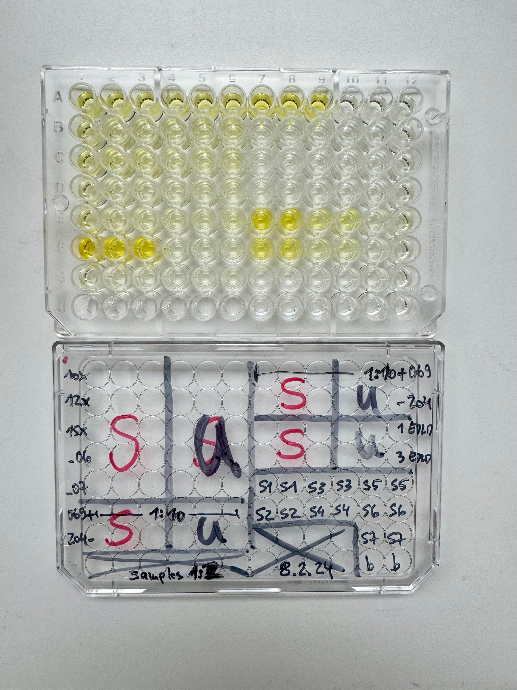
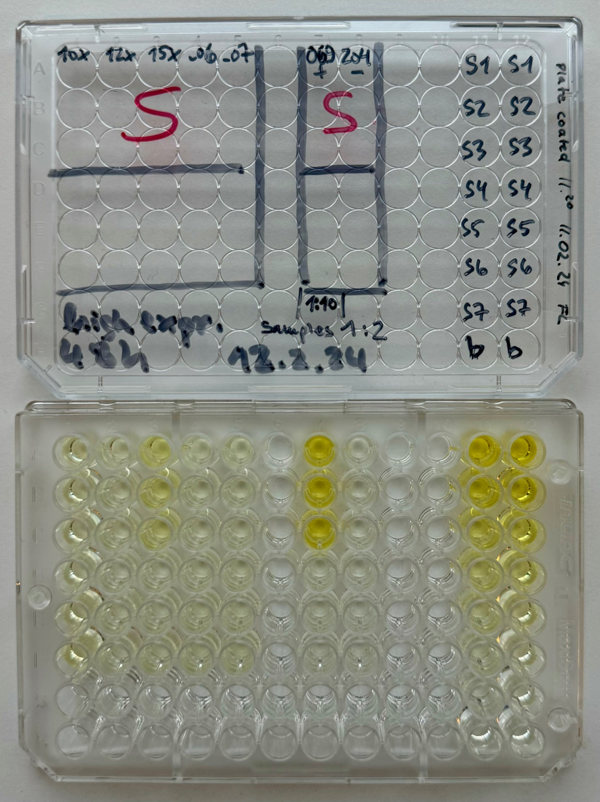

### Loading the necessary libraries and packages

```{r}
library(pacman)
pacman::p_load(data.table, ggplot2, lubridate, stringr, ggpubr, dplyr, cowplot, readxl, scales, knitr)

Input_Directory <- "./ALL_PLATES/"
save_to         <- Input_Directory
```

- Cell line names for plots are stored in *ELISA_CL_KEY.csv*

```{r}
# adjust the names as needed!
NAME_KEY <- fread("./ELISA_CL_KEY.csv", header = T) 
# head(NAME_KEY, n = 10)
```

- Loading necessary functions to analyze the data

```{r}
source(file = ifelse(exists("https://raw.githubusercontent.com/tlobnow/coding_universe/main/scripts/ELISA_Fx.R"), 
                     yes =  "https://raw.githubusercontent.com/tlobnow/coding_universe/main/scripts/ELISA_Fx.R",
                     no  =  "./scripts/ELISA_Fx.R"))
```

### From raw measurements to estimated sample concentrations

1.  Calculate the mean values per Standard Curve dilution step
2.  Plot the Standard curve and fit a linear trend line
3.  Save the plots

We use the equation to estimate IL-2 conc. of our unknown samples

Running ELISA_Fx() to generate standard curves and calculate the IL-2 concentrations.

```{r, echo = F, warning = F, message = F}
All_plates_data_raw <- ELISA_Fx(Input_Directory, Output_Directory)
All_plates_data     <- left_join(All_plates_data_raw, NAME_KEY)
All_plates_data     <- All_plates_data %>% filter(CELL_LINE != "NA")
DF                  <- All_plates_data
```

### Amyoids ELISA Results 2024-01-31


```{r, message = F, warning = F}
FILTER_VALUES = as.IDate("2024-01-31")
FILTER_VALUE = as.IDate("2024-01-31")
FILTER_TYPE   = "DATE"
POSITIVE_CTRL = c("WT_EL4", "cl069")
NEGATIVE_CTRL = c("204_TRIPLE_KO", "tKO_EL4")
save = T

x_label = ""
y_label = "relative IL-2 conc."
plot_title = "IL-2 ELISA"
subtitle = paste0("Assay performed for ", FILTER_VALUES, ", based on filter type ", FILTER_TYPE)
DF = All_plates_data
SEED = 1
plot_pval = T
plot_faceted_by_date = F
formatted_date <- format(as.IDate(FILTER_VALUES), "%Y%m%d")

# processing ELISA
ALL_COHORT_DATA <- lapply(FILTER_VALUES, function(FILTER_VALUE) {
  # Step 1: Filter & Subset the main data into lists
  COHORT_DATA <- filter_data(DF, FILTER_VALUE, FILTER_TYPE, POSITIVE_CTRL, NEGATIVE_CTRL)
  
  # extra filter
  COHORT_DATA <- COHORT_DATA %>%
  filter((Plate == 1 & STIM_CONCENTRATION == 5) | 
         (Plate == 2 & CELL_LINE == "cl204" & STIM_CONCENTRATION == 5) | 
         !(Plate == 2 & CELL_LINE == "cl204" & STIM_CONCENTRATION == 5 & MEASUREMENT > 1))
  
  COHORT_DATA <- COHORT_DATA %>%
    filter(STIM_CONCENTRATION == 5) %>%
    filter(!(CELL_LINE == "cl204" & MEASUREMENT > 1)) %>%
    filter(Plate != 3)
  
  # Prepare Normalization
  group_vars <- c("Date", "STIM_DAY")
  
  baseline <- COHORT_DATA %>%
      group_by(!!!syms(group_vars)) %>%
      filter((CELL_LINE %in% NEGATIVE_CTRL & CONDITION == "UNSTIM") | (CL_NAME_ON_PLOT %in% NEGATIVE_CTRL & CONDITION == "UNSTIM")) %>%
      summarise(baseline_control_value = mean(Concentration))
  
   # Join the calculated values with the dataset
  data <- left_join(COHORT_DATA, baseline, by = group_vars) %>%
      mutate(Concentration_REDUCED = case_when(!is.na(baseline_control_value) ~ Concentration - baseline_control_value, TRUE ~ Concentration))
  
  control_mean_per_day <- data %>%
      filter((CELL_LINE %in% POSITIVE_CTRL & CONDITION == "STIM") | (CL_NAME_ON_PLOT %in% POSITIVE_CTRL & CONDITION == "STIM")) %>%
      group_by(!!!syms(group_vars)) %>%
      summarise(control_mean_MEASUREMENT = case_when(mean(Concentration_REDUCED) > 0 ~ mean(Concentration_REDUCED), TRUE ~ -Inf))
    
    # Join the calculated control means
    data <- left_join(data, control_mean_per_day, by = group_vars)
    
    # Perform normalization
    DATA_NORMALIZED <- data %>%
      group_by(!!!syms(group_vars), CELL_LINE, CONDITION) %>%
      mutate(Concentration_NORMALIZED = case_when(Concentration_REDUCED / control_mean_MEASUREMENT < 0 ~ 0, TRUE ~ Concentration_REDUCED / control_mean_MEASUREMENT),
             triplicate_mean_per_day  = mean(Concentration_NORMALIZED)) %>%
      ungroup()
  NORMALIZED_DATA <- DATA_NORMALIZED
  return(NORMALIZED_DATA)
})

# Step 4: Combine the subset lists into one data frame
COMBINED_DATA <- bind_rows(ALL_COHORT_DATA)

# Step 5: Calculate the means per cohort
MEANS <- COMBINED_DATA %>%
  group_by(CELL_LINE, CONDITION, Date, PLOTTING_COLOR) %>%
  distinct(triplicate_mean_per_day, STIM_DAY, .keep_all = TRUE) %>%
  ungroup()

# Create a data frame with unique CL_NAME_ON_PLOT and corresponding PLOTTING_COLOR
color_mapping <- unique(MEANS[, c("CL_NAME_ON_PLOT", "PLOTTING_COLOR")])

# Filter rows where CONDITION is "UNSTIM" and set PLOTTING_COLOR to "gray50"
MEANS$PLOTTING_COLOR[MEANS$CONDITION == "UNSTIM"] <- "gray50"
# MEANS$PLOTTING_COLOR[MEANS$CONDITION == "STIM"] <- "#A6529A"

# Merge the MEANS data frame with the color_mapping data frame using dplyr
MEANS_merged <- MEANS %>%
  left_join(color_mapping) %>%
  mutate(CL_NAME_ON_PLOT = factor(CL_NAME_ON_PLOT, levels = unique(MEANS$CL_NAME_ON_PLOT)))

# Reorder CL_NAME_ON_PLOT based on ORDER_NO
MEANS_merged$CL_NAME_ON_PLOT <- reorder(MEANS$CL_NAME_ON_PLOT, -MEANS_merged$ORDER_NO)
MEANS_merged$STIM_DAY <- as.factor(MEANS_merged$STIM_DAY)

# Step 6: Calculate the mean of means (MOM) per cohort
MOM_SUBSET <- MEANS_merged %>%
  group_by(CELL_LINE, CL_NAME_ON_PLOT, CONDITION, Date, PLOTTING_COLOR, ORDER_NO) %>%
  summarise(triplicate_sd_per_day = sd(triplicate_mean_per_day),
            triplicate_mean_per_day = mean(triplicate_mean_per_day)) %>%
  distinct(.keep_all = TRUE)

# Step 7: Perform statistics per cohort
STATISTICAL_RESULTS <- perform_statistical_analysis(MEANS_merged, "CL_NAME_ON_PLOT")

# Your ggplot code
my_plot <- ggplot(MEANS_merged, aes(x = CL_NAME_ON_PLOT)) +
  geom_col(data = MOM_SUBSET,
           aes(y = triplicate_mean_per_day, fill = CONDITION), 
           position = position_dodge(width = 1),
           alpha = 0.5) +
  geom_point(data = MEANS_merged,
             aes(y = triplicate_mean_per_day, group = CONDITION, shape = STIM_DAY),
             position = position_jitterdodge(jitter.height = 0, jitter.width = 1.2, seed = SEED),
             col = "white", size = 4) +
  geom_point(data = MEANS_merged, aes(y = triplicate_mean_per_day, group = CONDITION, shape = STIM_DAY),
             position = position_jitterdodge(jitter.height = 0, jitter.width = 1.2, seed = SEED),
             col = "black", size = 3) +
  geom_errorbar(data = MOM_SUBSET, aes(ymin = triplicate_mean_per_day - triplicate_sd_per_day,
                                       ymax = triplicate_mean_per_day + triplicate_sd_per_day, group = CONDITION),
                width = 0.25, position = position_dodge(width = 1)) +
  labs(x = x_label,
       y = y_label) +
  scale_fill_manual(values = c("UNSTIM" = "gray50", "STIM" = "#A6529A")) +
  ggtitle(plot_title, paste0("IL-1ß Concentration ", unique(MEANS_merged$STIM_CONCENTRATION), "ng/mL \n",
                                        "Stimulation Time ", unique(MEANS_merged$STIM_TIME), "hrs")) +
  theme_cowplot() +
  theme(legend.position = "bottom") +
  theme(plot.title = element_text(hjust = 0.5)) +
  coord_flip() +
  facet_wrap(~Date)

my_plot

if (save) {
  # Step 9: Create Output Folder
  folder_path <- file.path(save_to, paste0("Plate_1_", formatted_date))
  if (!dir.exists(folder_path)) {dir.create(folder_path, recursive = TRUE)}   # Check if the folder exists, and if not, create it
  
  # Step 10: Save Plots and Data
  save_plots(folder_name = basename(folder_path), plots = list(my_plot))
  fwrite(COMBINED_DATA,       file = paste0(folder_path, "/COMBINED_DATA.csv"),       append = F, quote = F, row.names = F, col.names = T)
  fwrite(MEANS,               file = paste0(folder_path, "/MEANS.csv"),               append = F, quote = F, row.names = F, col.names = T)
  fwrite(MOM_SUBSET,          file = paste0(folder_path, "/MOM_SUBSET.csv"),          append = F, quote = F, row.names = F, col.names = T)
  fwrite(STATISTICAL_RESULTS, file = paste0(folder_path, "/STATISTICAL_RESULTS.csv"), append = F, quote = F, row.names = F, col.names = T)
}
```

```{r, message = F, warning = F}
FILTER_VALUES = as.IDate("2024-01-31")
FILTER_VALUE = as.IDate("2024-01-31")
FILTER_TYPE   = "DATE"
POSITIVE_CTRL = c("WT_EL4", "cl069")
NEGATIVE_CTRL = c("204_TRIPLE_KO", "tKO_EL4")
save = T

x_label = ""
y_label = "relative IL-2 conc."
plot_title = "IL-2 ELISA"
subtitle = paste0("Assay performed for ", FILTER_VALUES, ", based on filter type ", FILTER_TYPE)
DF = All_plates_data
SEED = 1
plot_pval = T
plot_faceted_by_date = F
formatted_date <- format(as.IDate(FILTER_VALUES), "%Y%m%d")

# processing ELISA
ALL_COHORT_DATA <- lapply(FILTER_VALUES, function(FILTER_VALUE) {
  # Step 1: Filter & Subset the main data into lists
  COHORT_DATA <- filter_data(DF, FILTER_VALUE, FILTER_TYPE, POSITIVE_CTRL, NEGATIVE_CTRL)
  
  # extra filter
  COHORT_DATA <- COHORT_DATA %>%
    filter(STIM_CONCENTRATION == 100) %>%
    filter(!(Plate == 2 & CELL_LINE == "cl204" & STIM_CONCENTRATION == 100 & MEASUREMENT > 1))

  # Prepare Normalization
  group_vars <- c("Date", "STIM_DAY")
  
  baseline <- COHORT_DATA %>%
      group_by(!!!syms(group_vars)) %>%
      filter((CELL_LINE %in% NEGATIVE_CTRL & CONDITION == "UNSTIM") | (CL_NAME_ON_PLOT %in% NEGATIVE_CTRL & CONDITION == "UNSTIM")) %>%
      summarise(baseline_control_value = mean(Concentration))
  
   # Join the calculated values with the dataset
  data <- left_join(COHORT_DATA, baseline, by = group_vars) %>%
      mutate(Concentration_REDUCED = case_when(!is.na(baseline_control_value) ~ Concentration - baseline_control_value, TRUE ~ Concentration))
  
  control_mean_per_day <- data %>%
      filter((CELL_LINE %in% POSITIVE_CTRL & CONDITION == "STIM") | (CL_NAME_ON_PLOT %in% POSITIVE_CTRL & CONDITION == "STIM")) %>%
      group_by(!!!syms(group_vars)) %>%
      summarise(control_mean_MEASUREMENT = case_when(mean(Concentration_REDUCED) > 0 ~ mean(Concentration_REDUCED), TRUE ~ -Inf))
    
    # Join the calculated control means
    data <- left_join(data, control_mean_per_day, by = group_vars)
    
    # Perform normalization
    DATA_NORMALIZED <- data %>%
      group_by(!!!syms(group_vars), CELL_LINE, CONDITION) %>%
      mutate(Concentration_NORMALIZED = case_when(Concentration_REDUCED / control_mean_MEASUREMENT < 0 ~ 0, TRUE ~ Concentration_REDUCED / control_mean_MEASUREMENT),
             triplicate_mean_per_day  = mean(Concentration_NORMALIZED)) %>%
      ungroup()
  NORMALIZED_DATA <- DATA_NORMALIZED
  return(NORMALIZED_DATA)
})

# Step 4: Combine the subset lists into one data frame
COMBINED_DATA <- bind_rows(ALL_COHORT_DATA)

# Step 5: Calculate the means per cohort
MEANS <- COMBINED_DATA %>%
  group_by(CELL_LINE, CONDITION, Date, PLOTTING_COLOR) %>%
  distinct(triplicate_mean_per_day, STIM_DAY, .keep_all = TRUE) %>%
  ungroup()

# Create a data frame with unique CL_NAME_ON_PLOT and corresponding PLOTTING_COLOR
color_mapping <- unique(MEANS[, c("CL_NAME_ON_PLOT", "PLOTTING_COLOR")])

# Filter rows where CONDITION is "UNSTIM" and set PLOTTING_COLOR to "gray50"
MEANS$PLOTTING_COLOR[MEANS$CONDITION == "UNSTIM"] <- "gray50"
# MEANS$PLOTTING_COLOR[MEANS$CONDITION == "STIM"] <- "#A6529A"

# Merge the MEANS data frame with the color_mapping data frame using dplyr
MEANS_merged <- MEANS %>%
  left_join(color_mapping) %>%
  mutate(CL_NAME_ON_PLOT = factor(CL_NAME_ON_PLOT, levels = unique(MEANS$CL_NAME_ON_PLOT)))

# Reorder CL_NAME_ON_PLOT based on ORDER_NO
MEANS_merged$CL_NAME_ON_PLOT <- reorder(MEANS$CL_NAME_ON_PLOT, -MEANS_merged$ORDER_NO)
MEANS_merged$STIM_DAY <- as.factor(MEANS_merged$STIM_DAY)

# Step 6: Calculate the mean of means (MOM) per cohort
MOM_SUBSET <- MEANS_merged %>%
  group_by(CELL_LINE, CL_NAME_ON_PLOT, CONDITION, Date, PLOTTING_COLOR, ORDER_NO) %>%
  summarise(triplicate_sd_per_day = sd(triplicate_mean_per_day),
            triplicate_mean_per_day = mean(triplicate_mean_per_day)) %>%
  distinct(.keep_all = TRUE)

# Step 7: Perform statistics per cohort
STATISTICAL_RESULTS <- perform_statistical_analysis(MEANS_merged, "CL_NAME_ON_PLOT")

# Your ggplot code
my_plot <- ggplot(MEANS_merged, aes(x = CL_NAME_ON_PLOT)) +
  geom_col(data = MOM_SUBSET,
           aes(y = triplicate_mean_per_day, fill = CONDITION), 
           position = position_dodge(width = 1),
           alpha = 0.5) +
  geom_point(data = MEANS_merged,
             aes(y = triplicate_mean_per_day, group = CONDITION, shape = STIM_DAY),
             position = position_jitterdodge(jitter.height = 0, jitter.width = 1.2, seed = SEED),
             col = "white", size = 4) +
  geom_point(data = MEANS_merged, aes(y = triplicate_mean_per_day, group = CONDITION, shape = STIM_DAY),
             position = position_jitterdodge(jitter.height = 0, jitter.width = 1.2, seed = SEED),
             col = "black", size = 3) +
  geom_errorbar(data = MOM_SUBSET, aes(ymin = triplicate_mean_per_day - triplicate_sd_per_day,
                                       ymax = triplicate_mean_per_day + triplicate_sd_per_day, group = CONDITION),
                width = 0.25, position = position_dodge(width = 1)) +
  labs(x = x_label,
       y = y_label) +
  scale_fill_manual(values = c("UNSTIM" = "gray50", "STIM" = "#A6529A")) +
  ggtitle(plot_title, paste0("IL-1ß Concentration ", unique(MEANS_merged$STIM_CONCENTRATION), "ng/mL \n",
                                        "Stimulation Time ", unique(MEANS_merged$STIM_TIME), "hrs")) +
  theme_cowplot() +
  theme(legend.position = "bottom") +
  theme(plot.title = element_text(hjust = 0.5)) +
  coord_flip() +
  facet_wrap(~Date)

my_plot

if (save) {
  # Step 9: Create Output Folder
  folder_path <- file.path(save_to, paste0("Plate_2_", formatted_date))
  if (!dir.exists(folder_path)) {dir.create(folder_path, recursive = TRUE)}   # Check if the folder exists, and if not, create it
  
  # Step 10: Save Plots and Data
  save_plots(folder_name = basename(folder_path), plots = list(my_plot))
  fwrite(COMBINED_DATA,       file = paste0(folder_path, "/COMBINED_DATA.csv"),       append = F, quote = F, row.names = F, col.names = T)
  fwrite(MEANS,               file = paste0(folder_path, "/MEANS.csv"),               append = F, quote = F, row.names = F, col.names = T)
  fwrite(MOM_SUBSET,          file = paste0(folder_path, "/MOM_SUBSET.csv"),          append = F, quote = F, row.names = F, col.names = T)
  fwrite(STATISTICAL_RESULTS, file = paste0(folder_path, "/STATISTICAL_RESULTS.csv"), append = F, quote = F, row.names = F, col.names = T)
}
```

```{r, message = F, warning = F}
FILTER_VALUES = as.IDate("2024-01-31")
FILTER_TYPE   = "DATE"
POSITIVE_CTRL = c("WT_EL4", "cl069")
NEGATIVE_CTRL = c("204_TRIPLE_KO", "tKO_EL4")
x_label = ""
y_label = "relative IL-2 conc."
plot_title = "IL-2 ELISA"
subtitle = paste0("Assay performed for ", FILTER_VALUES, ", based on filter type ", FILTER_TYPE)
save = T


SEED = 1
plot_pval = T
plot_faceted_by_date = F
formatted_date <- format(as.IDate(FILTER_VALUES), "%Y%m%d")

# processing ELISA
ALL_COHORT_DATA <- lapply(FILTER_VALUES, function(FILTER_VALUE) {
  # Step 1: Filter & Subset the main data into lists
  COHORT_DATA <- filter_data(DF, FILTER_VALUE, FILTER_TYPE, POSITIVE_CTRL, NEGATIVE_CTRL)
  
  # extra filter
  COHORT_DATA <- COHORT_DATA %>% filter(Plate == 3)
  
  # Step 2 and Step 3
  NORMALIZED_DATA <- calculate_baseline_and_control(COHORT_DATA, FILTER_TYPE, POSITIVE_CTRL, NEGATIVE_CTRL)
  return(NORMALIZED_DATA)
})

# Step 4: Combine the subset lists into one data frame
COMBINED_DATA <- bind_rows(ALL_COHORT_DATA)


# Step 5: Calculate the means per cohort
MEANS <- COMBINED_DATA %>%
  group_by(CELL_LINE, CONDITION, Date, PLOTTING_COLOR) %>%
  distinct(triplicate_mean_per_day, STIM_DAY, .keep_all = TRUE) %>%
  ungroup()

# Create a data frame with unique CL_NAME_ON_PLOT and corresponding PLOTTING_COLOR
color_mapping <- unique(MEANS[, c("CL_NAME_ON_PLOT", "PLOTTING_COLOR")])

# Filter rows where CONDITION is "UNSTIM" and set PLOTTING_COLOR to "gray50"
MEANS$PLOTTING_COLOR[MEANS$CONDITION == "UNSTIM"] <- "gray50"
# MEANS$PLOTTING_COLOR[MEANS$CONDITION == "STIM"] <- "#A6529A"

# Merge the MEANS data frame with the color_mapping data frame using dplyr
MEANS_merged <- MEANS %>%
  left_join(color_mapping) %>%
  mutate(CL_NAME_ON_PLOT = factor(CL_NAME_ON_PLOT, levels = unique(MEANS$CL_NAME_ON_PLOT)))

# Reorder CL_NAME_ON_PLOT based on ORDER_NO
MEANS_merged$CL_NAME_ON_PLOT <- reorder(MEANS$CL_NAME_ON_PLOT, -MEANS_merged$ORDER_NO)
MEANS_merged$STIM_DAY <- as.factor(MEANS_merged$STIM_DAY)

# Step 6: Calculate the mean of means (MOM) per cohort
MOM_SUBSET <- MEANS_merged %>%
  group_by(CELL_LINE, CL_NAME_ON_PLOT, CONDITION, Date, PLOTTING_COLOR, ORDER_NO) %>%
  summarise(triplicate_sd_per_day = sd(triplicate_mean_per_day),
            triplicate_mean_per_day = mean(triplicate_mean_per_day)) %>%
  distinct(.keep_all = TRUE)

# Step 7: Perform statistics per cohort
STATISTICAL_RESULTS <- perform_statistical_analysis(MEANS_merged, "CL_NAME_ON_PLOT")

# Your ggplot code
my_plot <- ggplot(MEANS_merged, aes(x = CL_NAME_ON_PLOT)) +
  geom_col(data = MOM_SUBSET,
           aes(y = triplicate_mean_per_day, fill = CONDITION), 
           position = position_dodge(width = 1),
           alpha = 0.5) +
  geom_point(data = MEANS_merged,
             aes(y = triplicate_mean_per_day, group = CONDITION, shape = STIM_DAY),
             position = position_jitterdodge(jitter.height = 0, jitter.width = 1.2, seed = SEED),
             col = "white", size = 4) +
  geom_point(data = MEANS_merged, aes(y = triplicate_mean_per_day, group = CONDITION, shape = STIM_DAY),
             position = position_jitterdodge(jitter.height = 0, jitter.width = 1.2, seed = SEED),
             col = "black", size = 3) +
  geom_errorbar(data = MOM_SUBSET, aes(ymin = triplicate_mean_per_day - triplicate_sd_per_day,
                                       ymax = triplicate_mean_per_day + triplicate_sd_per_day, group = CONDITION),
                width = 0.25, position = position_dodge(width = 1)) +
  labs(x = x_label,
       y = y_label) +
  scale_fill_manual(values = c("UNSTIM" = "gray50", "STIM" = "#A6529A")) +
  ggtitle(plot_title, paste0("IL-1ß Concentration ", unique(MEANS_merged$STIM_CONCENTRATION), "ng/mL \n",
                                        "Stimulation Time ", unique(MEANS_merged$STIM_TIME), "hrs")) +
  theme_cowplot() +
  theme(legend.position = "bottom") +
  theme(plot.title = element_text(hjust = 0.5)) +
  coord_flip() +
  facet_wrap(~Date)

my_plot

if (save) {
  # Step 9: Create Output Folder
  folder_path <- file.path(save_to, paste0("Plate_3_", formatted_date))
  if (!dir.exists(folder_path)) {dir.create(folder_path, recursive = TRUE)}   # Check if the folder exists, and if not, create it
  
  # Step 10: Save Plots and Data
  save_plots(folder_name = basename(folder_path), plots = list(my_plot))
  fwrite(COMBINED_DATA,       file = paste0(folder_path, "/COMBINED_DATA.csv"),       append = F, quote = F, row.names = F, col.names = T)
  fwrite(MEANS,               file = paste0(folder_path, "/MEANS.csv"),               append = F, quote = F, row.names = F, col.names = T)
  fwrite(MOM_SUBSET,          file = paste0(folder_path, "/MOM_SUBSET.csv"),          append = F, quote = F, row.names = F, col.names = T)
  fwrite(STATISTICAL_RESULTS, file = paste0(folder_path, "/STATISTICAL_RESULTS.csv"), append = F, quote = F, row.names = F, col.names = T)
}
```

### Amyoids ELISA Results 2024-02-08

{width=40%}

```{r, message = F, warning = F}
FILTER_VALUES = as.IDate("2024-02-08")
FILTER_TYPE   = "DATE"
POSITIVE_CTRL = c("WT_EL4", "cl069")
NEGATIVE_CTRL = c("204_TRIPLE_KO", "tKO_EL4")
x_label = ""
y_label = "relative IL-2 conc."
plot_title = "IL-2 ELISA"
subtitle = paste0("Assay performed for ", FILTER_VALUES, ", based on filter type ", FILTER_TYPE)
save = T


SEED = 1
plot_pval = T
plot_faceted_by_date = F
formatted_date <- format(as.IDate(FILTER_VALUES), "%Y%m%d")

# processing ELISA
ALL_COHORT_DATA <- lapply(FILTER_VALUES, function(FILTER_VALUE) {
  # Step 1: Filter & Subset the main data into lists
  COHORT_DATA <- filter_data(DF, FILTER_VALUE, FILTER_TYPE, POSITIVE_CTRL, NEGATIVE_CTRL)
  
  # extra filter
  COHORT_DATA <- COHORT_DATA %>% filter(Plate == 1)
  
  # Step 2 and Step 3
  NORMALIZED_DATA <- calculate_baseline_and_control(COHORT_DATA, FILTER_TYPE, POSITIVE_CTRL, NEGATIVE_CTRL)
  return(NORMALIZED_DATA)
})

# Step 4: Combine the subset lists into one data frame
COMBINED_DATA <- bind_rows(ALL_COHORT_DATA)

# Step 5: Calculate the means per cohort
MEANS <- COMBINED_DATA %>%
  group_by(CELL_LINE, CONDITION, Date, PLOTTING_COLOR) %>%
  distinct(triplicate_mean_per_day, STIM_DAY, .keep_all = TRUE) %>%
  ungroup()

# Create a data frame with unique CL_NAME_ON_PLOT and corresponding PLOTTING_COLOR
color_mapping <- unique(MEANS[, c("CL_NAME_ON_PLOT", "PLOTTING_COLOR")])

# Filter rows where CONDITION is "UNSTIM" and set PLOTTING_COLOR to "gray50"
MEANS$PLOTTING_COLOR[MEANS$CONDITION == "UNSTIM"] <- "gray50"
# MEANS$PLOTTING_COLOR[MEANS$CONDITION == "STIM"] <- "#A6529A"

# Merge the MEANS data frame with the color_mapping data frame using dplyr
MEANS_merged <- MEANS %>%
  left_join(color_mapping) %>%
  mutate(CL_NAME_ON_PLOT = factor(CL_NAME_ON_PLOT, levels = unique(MEANS$CL_NAME_ON_PLOT)))

# Reorder CL_NAME_ON_PLOT based on ORDER_NO
MEANS_merged$CL_NAME_ON_PLOT <- reorder(MEANS$CL_NAME_ON_PLOT, -MEANS_merged$ORDER_NO)
MEANS_merged$STIM_DAY <- as.factor(MEANS_merged$STIM_DAY)

# Step 6: Calculate the mean of means (MOM) per cohort
MOM_SUBSET <- MEANS_merged %>%
  group_by(CELL_LINE, CL_NAME_ON_PLOT, CONDITION, Date, PLOTTING_COLOR, ORDER_NO) %>%
  summarise(triplicate_sd_per_day = sd(triplicate_mean_per_day),
            triplicate_mean_per_day = mean(triplicate_mean_per_day)) %>%
  distinct(.keep_all = TRUE)

# Step 7: Perform statistics per cohort
STATISTICAL_RESULTS <- perform_statistical_analysis(MEANS_merged, "CL_NAME_ON_PLOT")

# Your ggplot code
my_plot <- ggplot(MEANS_merged, aes(x = CL_NAME_ON_PLOT)) +
  geom_col(data = MOM_SUBSET,
           aes(y = triplicate_mean_per_day, fill = CONDITION), 
           position = position_dodge(width = 1),
           alpha = 0.5) +
  geom_point(data = MEANS_merged,
             aes(y = triplicate_mean_per_day, group = CONDITION, shape = STIM_DAY),
             position = position_jitterdodge(jitter.height = 0, jitter.width = 1.2, seed = SEED),
             col = "white", size = 4) +
  geom_point(data = MEANS_merged, aes(y = triplicate_mean_per_day, group = CONDITION, shape = STIM_DAY),
             position = position_jitterdodge(jitter.height = 0, jitter.width = 1.2, seed = SEED),
             col = "black", size = 3) +
  geom_errorbar(data = MOM_SUBSET, aes(ymin = triplicate_mean_per_day - triplicate_sd_per_day,
                                       ymax = triplicate_mean_per_day + triplicate_sd_per_day, group = CONDITION),
                width = 0.25, position = position_dodge(width = 1)) +
  labs(x = x_label,
       y = y_label) +
  scale_fill_manual(values = c("UNSTIM" = "gray50", "STIM" = "#A6529A")) +
  ggtitle(plot_title, subtitle = paste0("IL-1ß Concentration ", unique(MEANS_merged$STIM_CONCENTRATION), "ng/mL \n",
                                        "Stimulation Time ", unique(MEANS_merged$STIM_TIME), "hrs")) +
  theme_cowplot() +
  theme(legend.position = "bottom") +
  theme(plot.title = element_text(hjust = 0.5)) +
  coord_flip() +
  facet_wrap(~Date)

my_plot

if (save) {
  # Step 9: Create Output Folder
  folder_path <- file.path(save_to, paste0("Plate_1_", formatted_date))
  if (!dir.exists(folder_path)) {dir.create(folder_path, recursive = TRUE)}   # Check if the folder exists, and if not, create it
  
  # Step 10: Save Plots and Data
  save_plots(folder_name = basename(folder_path), plots = list(my_plot))
  fwrite(COMBINED_DATA,       file = paste0(folder_path, "/COMBINED_DATA.csv"),       append = F, quote = F, row.names = F, col.names = T)
  fwrite(MEANS,               file = paste0(folder_path, "/MEANS.csv"),               append = F, quote = F, row.names = F, col.names = T)
  fwrite(MOM_SUBSET,          file = paste0(folder_path, "/MOM_SUBSET.csv"),          append = F, quote = F, row.names = F, col.names = T)
  fwrite(STATISTICAL_RESULTS, file = paste0(folder_path, "/STATISTICAL_RESULTS.csv"), append = F, quote = F, row.names = F, col.names = T)
}
```

```{r, message = F, warning = F}
FILTER_VALUES = as.IDate("2024-02-08")
FILTER_TYPE   = "DATE"
POSITIVE_CTRL = c("WT_EL4", "cl069")
NEGATIVE_CTRL = c("204_TRIPLE_KO", "tKO_EL4")
x_label = ""
y_label = "relative IL-2 conc."
plot_title = "IL-2 ELISA"
subtitle = paste0("Assay performed for ", FILTER_VALUES, ", based on filter type ", FILTER_TYPE)
save = T


SEED = 600
plot_pval = T
plot_faceted_by_date = F
formatted_date <- format(as.IDate(FILTER_VALUES), "%Y%m%d")

# processing ELISA
ALL_COHORT_DATA <- lapply(FILTER_VALUES, function(FILTER_VALUE) {
  # Step 1: Filter & Subset the main data into lists
  COHORT_DATA <- filter_data(DF, FILTER_VALUE, FILTER_TYPE, POSITIVE_CTRL, NEGATIVE_CTRL)
  
  # extra filter
  COHORT_DATA <- COHORT_DATA %>% filter(Plate == 2)
  
  # Step 2 and Step 3
  NORMALIZED_DATA <- calculate_baseline_and_control(COHORT_DATA, FILTER_TYPE, POSITIVE_CTRL, NEGATIVE_CTRL)
  return(NORMALIZED_DATA)
})

# Step 4: Combine the subset lists into one data frame
COMBINED_DATA <- bind_rows(ALL_COHORT_DATA)

# Step 5: Calculate the means per cohort
MEANS <- COMBINED_DATA %>%
  group_by(CELL_LINE, CONDITION, Date, PLOTTING_COLOR) %>%
  distinct(triplicate_mean_per_day, STIM_DAY, .keep_all = TRUE) %>%
  ungroup()

# Create a data frame with unique CL_NAME_ON_PLOT and corresponding PLOTTING_COLOR
color_mapping <- unique(MEANS[, c("CL_NAME_ON_PLOT", "PLOTTING_COLOR")])

# Filter rows where CONDITION is "UNSTIM" and set PLOTTING_COLOR to "gray50"
MEANS$PLOTTING_COLOR[MEANS$CONDITION == "UNSTIM"] <- "gray50"
# MEANS$PLOTTING_COLOR[MEANS$CONDITION == "STIM"] <- "#A6529A"

# Merge the MEANS data frame with the color_mapping data frame using dplyr
MEANS_merged <- MEANS %>%
  left_join(color_mapping) %>%
  mutate(CL_NAME_ON_PLOT = factor(CL_NAME_ON_PLOT, levels = unique(MEANS$CL_NAME_ON_PLOT)))

# Reorder CL_NAME_ON_PLOT based on ORDER_NO
MEANS_merged$CL_NAME_ON_PLOT <- reorder(MEANS$CL_NAME_ON_PLOT, -MEANS_merged$ORDER_NO)
MEANS_merged$STIM_DAY <- as.factor(MEANS_merged$STIM_DAY)

# Step 6: Calculate the mean of means (MOM) per cohort
MOM_SUBSET <- MEANS_merged %>%
  group_by(CELL_LINE, CL_NAME_ON_PLOT, CONDITION, Date, PLOTTING_COLOR, ORDER_NO) %>%
  summarise(triplicate_sd_per_day = sd(triplicate_mean_per_day),
            triplicate_mean_per_day = mean(triplicate_mean_per_day)) %>%
  distinct(.keep_all = TRUE)

# Step 7: Perform statistics per cohort
STATISTICAL_RESULTS <- perform_statistical_analysis(MEANS_merged, "CL_NAME_ON_PLOT")

# Your ggplot code
my_plot <- ggplot(MEANS_merged, aes(x = CL_NAME_ON_PLOT)) +
  geom_col(data = MOM_SUBSET,
           aes(y = triplicate_mean_per_day, fill = CONDITION), 
           position = position_dodge(width = 1),
           alpha = 0.5) +
  geom_point(data = MEANS_merged,
             aes(y = triplicate_mean_per_day, group = CONDITION, shape = STIM_DAY),
             position = position_jitterdodge(jitter.height = 0, jitter.width = 1.2, seed = SEED),
             col = "white", size = 4) +
  geom_point(data = MEANS_merged, aes(y = triplicate_mean_per_day, group = CONDITION, shape = STIM_DAY),
             position = position_jitterdodge(jitter.height = 0, jitter.width = 1.2, seed = SEED),
             col = "black", size = 3) +
  geom_errorbar(data = MOM_SUBSET, aes(ymin = triplicate_mean_per_day - triplicate_sd_per_day,
                                       ymax = triplicate_mean_per_day + triplicate_sd_per_day, group = CONDITION),
                width = 0.25, position = position_dodge(width = 1)) +
  labs(x = x_label,
       y = y_label) +
  scale_fill_manual(values = c("UNSTIM" = "gray50", "STIM" = "#A6529A")) +
  ggtitle(plot_title, subtitle = paste0("IL-1ß Concentration ", unique(MEANS_merged$STIM_CONCENTRATION), "ng/mL \n",
                                        "Stimulation Time ", unique(MEANS_merged$STIM_TIME), "hrs")) +
  theme_cowplot() +
  theme(legend.position = "bottom") +
  theme(plot.title = element_text(hjust = 0.5)) +
  coord_flip() +
  facet_wrap(~Date)

my_plot

if (save) {
  # Step 9: Create Output Folder
  folder_path <- file.path(save_to, paste0("Plate_2_", formatted_date))
  if (!dir.exists(folder_path)) {dir.create(folder_path, recursive = TRUE)}   # Check if the folder exists, and if not, create it
  
  # Step 10: Save Plots and Data
  save_plots(folder_name = basename(folder_path), plots = list(my_plot))
  fwrite(COMBINED_DATA,       file = paste0(folder_path, "/COMBINED_DATA.csv"),       append = F, quote = F, row.names = F, col.names = T)
  fwrite(MEANS,               file = paste0(folder_path, "/MEANS.csv"),               append = F, quote = F, row.names = F, col.names = T)
  fwrite(MOM_SUBSET,          file = paste0(folder_path, "/MOM_SUBSET.csv"),          append = F, quote = F, row.names = F, col.names = T)
  fwrite(STATISTICAL_RESULTS, file = paste0(folder_path, "/STATISTICAL_RESULTS.csv"), append = F, quote = F, row.names = F, col.names = T)
}
```
### Amyoids ELISA Results 2024-02-12

{width=40%}

``` {r}
FILTER_VALUES = as.IDate("2024-02-12")
FILTER_TYPE   = "DATE"
POSITIVE_CTRL = c("WT_EL4", "cl069")
NEGATIVE_CTRL = c("204_TRIPLE_KO", "tKO_EL4")
x_label = ""
y_label = "relative IL-2 conc."
plot_title = "IL-2 ELISA"
subtitle = paste0("Assay performed for ", FILTER_VALUES, ", based on filter type ", FILTER_TYPE)
save = T


SEED = 600
plot_pval = T
plot_faceted_by_date = F
formatted_date <- format(as.IDate(FILTER_VALUES), "%Y%m%d")

# processing ELISA
ALL_COHORT_DATA <- lapply(FILTER_VALUES, function(FILTER_VALUE) {
  # Step 1: Filter & Subset the main data into lists
  COHORT_DATA <- filter_data(DF, FILTER_VALUE, FILTER_TYPE, POSITIVE_CTRL, NEGATIVE_CTRL)
  
  # Step 2 and Step 3
  NORMALIZED_DATA <- calculate_baseline_and_control(COHORT_DATA, FILTER_TYPE, POSITIVE_CTRL, NEGATIVE_CTRL)
  return(NORMALIZED_DATA)
})

# Step 4: Combine the subset lists into one data frame
COMBINED_DATA <- bind_rows(ALL_COHORT_DATA)

# Step 5: Calculate the means per cohort
MEANS <- COMBINED_DATA %>%
  group_by(CELL_LINE, CONDITION, Date, PLOTTING_COLOR) %>%
  distinct(triplicate_mean_per_day, STIM_DAY, .keep_all = TRUE) %>%
  ungroup()

# Create a data frame with unique CL_NAME_ON_PLOT and corresponding PLOTTING_COLOR
color_mapping <- unique(MEANS[, c("CL_NAME_ON_PLOT", "PLOTTING_COLOR")])

# Filter rows where CONDITION is "UNSTIM" and set PLOTTING_COLOR to "gray50"
MEANS$PLOTTING_COLOR[MEANS$CONDITION == "UNSTIM"] <- "gray50"
# MEANS$PLOTTING_COLOR[MEANS$CONDITION == "STIM"] <- "#A6529A"

# Merge the MEANS data frame with the color_mapping data frame using dplyr
MEANS_merged <- MEANS %>%
  left_join(color_mapping) %>%
  mutate(CL_NAME_ON_PLOT = factor(CL_NAME_ON_PLOT, levels = unique(MEANS$CL_NAME_ON_PLOT)))

# Reorder CL_NAME_ON_PLOT based on ORDER_NO
MEANS_merged$CL_NAME_ON_PLOT <- reorder(MEANS$CL_NAME_ON_PLOT, -MEANS_merged$ORDER_NO)
MEANS_merged$STIM_DAY <- as.factor(MEANS_merged$STIM_DAY)

# Step 6: Calculate the mean of means (MOM) per cohort
MOM_SUBSET <- MEANS_merged %>%
  group_by(CELL_LINE, CL_NAME_ON_PLOT, CONDITION, Date, PLOTTING_COLOR, ORDER_NO) %>%
  summarise(triplicate_sd_per_day = sd(triplicate_mean_per_day),
            triplicate_mean_per_day = mean(triplicate_mean_per_day)) %>%
  distinct(.keep_all = TRUE)

# Step 7: Perform statistics per cohort
STATISTICAL_RESULTS <- perform_statistical_analysis(MEANS_merged, "CL_NAME_ON_PLOT")

# Your ggplot code
my_plot <- ggplot(MEANS_merged, aes(x = CL_NAME_ON_PLOT)) +
  geom_col(data = MOM_SUBSET,
           aes(y = triplicate_mean_per_day, fill = CONDITION), 
           position = position_dodge(width = 1),
           alpha = 0.5) +
  geom_point(data = MEANS_merged,
             aes(y = triplicate_mean_per_day, group = CONDITION, shape = STIM_DAY),
             position = position_jitterdodge(jitter.height = 0, jitter.width = 1.2, seed = SEED),
             col = "white", size = 4) +
  geom_point(data = MEANS_merged, aes(y = triplicate_mean_per_day, group = CONDITION, shape = STIM_DAY),
             position = position_jitterdodge(jitter.height = 0, jitter.width = 1.2, seed = SEED),
             col = "black", size = 3) +
  geom_errorbar(data = MOM_SUBSET, aes(ymin = triplicate_mean_per_day - triplicate_sd_per_day,
                                       ymax = triplicate_mean_per_day + triplicate_sd_per_day, group = CONDITION),
                width = 0.25, position = position_dodge(width = 1)) +
  labs(x = x_label,
       y = y_label) +
  scale_fill_manual(values = c("UNSTIM" = "gray50", "STIM" = "#A6529A")) +
  ggtitle(plot_title, subtitle = paste0("IL-1ß Concentration ", unique(MEANS_merged$STIM_CONCENTRATION), "ng/mL \n",
                                        "Stimulation Time ", unique(MEANS_merged$STIM_TIME), "hrs")) +
  theme_cowplot() +
  theme(legend.position = "bottom") +
  theme(plot.title = element_text(hjust = 0.5)) +
  coord_flip() +
  facet_wrap(~Date)

my_plot

if (save) {
  # Step 9: Create Output Folder
  folder_path <- file.path(save_to, paste0("Plate_1_", formatted_date))
  if (!dir.exists(folder_path)) {dir.create(folder_path, recursive = TRUE)}   # Check if the folder exists, and if not, create it
  
  # Step 10: Save Plots and Data
  save_plots(folder_name = basename(folder_path), plots = list(my_plot))
  fwrite(COMBINED_DATA,       file = paste0(folder_path, "/COMBINED_DATA.csv"),       append = F, quote = F, row.names = F, col.names = T)
  fwrite(MEANS,               file = paste0(folder_path, "/MEANS.csv"),               append = F, quote = F, row.names = F, col.names = T)
  fwrite(MOM_SUBSET,          file = paste0(folder_path, "/MOM_SUBSET.csv"),          append = F, quote = F, row.names = F, col.names = T)
  fwrite(STATISTICAL_RESULTS, file = paste0(folder_path, "/STATISTICAL_RESULTS.csv"), append = F, quote = F, row.names = F, col.names = T)
}
```

### Check Cell Lines Across Assays

``` {r, message = F, warning = F}
# What to adjust:
FILTER_VALUES = "CHARMS-15xTA"
FILTER_VALUE  = "CHARMS-15xTA"
FILTER_TYPE   = "COHORT"
POSITIVE_CTRL = c("cl069")
NEGATIVE_CTRL = c("tKO_EL4", "204_TRIPLE_KO")
COLOR         = "cornflowerblue"
x_label       = ""
y_label       = "relative IL-2 conc."
plot_title    = "IL-2 ELISA"
subtitle      = paste0("Assay performed for ", FILTER_VALUES, ", based on filter type ", FILTER_TYPE)
save          = T

# Automatic settings
DF = All_plates_data
DF$CL_NAME_ON_PLOT = reorder(DF$CL_NAME_ON_PLOT, -DF$ORDER_NO)
SEED = 600

ALL_COHORT_DATA <- lapply(FILTER_VALUES, function(FILTER_VALUE) {
    # Step 1: Filter & Subset the main data into lists
    COHORT_DATA <- filter_data(All_plates_data, FILTER_VALUE, FILTER_TYPE, POSITIVE_CTRL, NEGATIVE_CTRL)
    
    COHORT_DATA_CL <- COHORT_DATA %>% filter(CL_NAME_ON_PLOT == FILTER_VALUE) %>% filter(STIM_CONCENTRATION == 5)
    
    # extra filter
    COHORT_DATA <- COHORT_DATA %>%
      filter(STIM_CONCENTRATION == 5) %>%
      filter(Date %in% COHORT_DATA_CL$Date) %>%
      filter(!(Plate == 2 & CL_NAME_ON_PLOT == "tKO_EL4" & MEASUREMENT > 1))
    
    # Step 2 and Step 3
    NORMALIZED_DATA <- calculate_baseline_and_control(COHORT_DATA, FILTER_TYPE, POSITIVE_CTRL, NEGATIVE_CTRL)
    return(NORMALIZED_DATA)
})
  
COMBINED_DATA <- bind_rows(ALL_COHORT_DATA)

# Step 5: Calculate the means per cohort
MEANS <- COMBINED_DATA %>%
    group_by(CELL_LINE, CONDITION, Date) %>%
    distinct(triplicate_mean_per_day, STIM_DAY, .keep_all = TRUE) %>%
    ungroup()

MEANS$STIM_DAY <- as.factor(MEANS$STIM_DAY)

# Step 6: Calculate the mean of means (MOM) per cohort
MOM_SUBSET <- MEANS %>%
    group_by(CELL_LINE, CL_NAME_ON_PLOT, CONDITION, Date) %>%
    summarise(triplicate_sd_per_day = sd(triplicate_mean_per_day),
              triplicate_mean_per_day = mean(triplicate_mean_per_day)) %>%
    distinct(.keep_all = TRUE)

# Step 7: Perform statistics per cohort
STATISTICAL_RESULTS <- perform_statistical_analysis(MEANS, "CL_NAME_ON_PLOT")

# Step 8: Plot the results
plot_cell_line_summary <- ggplot(MEANS, aes(x = CL_NAME_ON_PLOT)) +
    geom_col(data = MOM_SUBSET, aes(y = triplicate_mean_per_day, fill = CONDITION), 
             position = position_dodge(width = 1), alpha = 0.5) +
    geom_point(data = MEANS, aes(y = triplicate_mean_per_day, group = CONDITION, shape = STIM_DAY),
               position = position_jitterdodge(jitter.height = 0, jitter.width = 1.2, seed = SEED), col = "white", size = 4) +
    geom_point(data = MEANS, aes(y = triplicate_mean_per_day, group = CONDITION, shape = STIM_DAY), 
               position = position_jitterdodge(jitter.height = 0, jitter.width = 1.2, seed = SEED), col = "black", size = 3) +
    geom_errorbar(data = MOM_SUBSET, aes(ymin = triplicate_mean_per_day - triplicate_sd_per_day, 
                                         ymax = triplicate_mean_per_day + triplicate_sd_per_day, group = CONDITION), width = 0.25, position = position_dodge(width = 1)) +
    labs(x = x_label, y = y_label) +
  geom_text(data = data.frame(CL_NAME_ON_PLOT = names(STATISTICAL_RESULTS[["annotations"]]), 
                              y = max(MEANS$triplicate_mean_per_day) + 0.1, label = STATISTICAL_RESULTS[["annotations"]]), 
            aes(y = y, label = label), col = "gray40", size = 4) +
  geom_text(data = data.frame(CL_NAME_ON_PLOT = names(STATISTICAL_RESULTS[["p_values"]]), 
                              y = max(MEANS$triplicate_mean_per_day) + 0.2, label = STATISTICAL_RESULTS[["p_values"]]), 
            aes(y = y, label = label), size = 7) +
    scale_fill_manual(values = c("UNSTIM" = "gray50", "STIM" = COLOR)) +
    ggtitle(plot_title, subtitle = paste0("IL-1ß Concentration ", unique(MEANS$STIM_CONCENTRATION), "ng/mL \n",
                                        "Stimulation Time ", unique(MEANS$STIM_TIME), "hrs")) +
    theme_cowplot() +
    theme(legend.position = "bottom") +
    theme(plot.title = element_text(hjust = 0.5)) +
  facet_wrap(~Date)

plot_cell_line_summary

if (save) {
  # Step 9: Create Output Folder
  folder_path <- file.path(save_to, paste0("CL_SUMMARY_", FILTER_VALUES, "_", unique(MEANS_merged$STIM_TIME), "hrs_", unique(MEANS_merged$STIM_CONCENTRATION), "ng_mL"))
  if (!dir.exists(folder_path)) {dir.create(folder_path, recursive = TRUE)}   # Check if the folder exists, and if not, create it
  
  # Step 10: Save Plots and Data
  save_plots(folder_name = basename(folder_path), plots = list(plot_cell_line_summary))
  
  fwrite(COMBINED_DATA,       file = paste0(folder_path, "/COMBINED_DATA.csv"),       append = F, quote = F, row.names = F, col.names = T)
  fwrite(MEANS,               file = paste0(folder_path, "/MEANS.csv"),               append = F, quote = F, row.names = F, col.names = T)
  fwrite(MOM_SUBSET,          file = paste0(folder_path, "/MOM_SUBSET.csv"),          append = F, quote = F, row.names = F, col.names = T)
  fwrite(STATISTICAL_RESULTS, file = paste0(folder_path, "/STATISTICAL_RESULTS.csv"), append = F, quote = F, row.names = F, col.names = T)
}
  
```

``` {r, message = F, warning = F}
# What to adjust:
FILTER_VALUES = "CHARMS-15xTA"
FILTER_TYPE   = "COHORT"
POSITIVE_CTRL = c("cl069")
NEGATIVE_CTRL = c("tKO_EL4", "204_TRIPLE_KO")
COLOR         = "cornflowerblue"
x_label       = ""
y_label       = "relative IL-2 conc."
plot_title    = "IL-2 ELISA"
subtitle      = paste0("Assay performed for ", FILTER_VALUES, ", based on filter type ", FILTER_TYPE)
save          = T

# Automatic settings
DF = All_plates_data
DF$CL_NAME_ON_PLOT = reorder(DF$CL_NAME_ON_PLOT, -DF$ORDER_NO)
SEED = 600

ALL_COHORT_DATA <- lapply(FILTER_VALUES, function(FILTER_VALUE) {
    # Step 1: Filter & Subset the main data into lists
    COHORT_DATA <- filter_data(All_plates_data, FILTER_VALUE, FILTER_TYPE, POSITIVE_CTRL, NEGATIVE_CTRL)
    
    # extra filter
    COHORT_DATA <- COHORT_DATA %>%
      filter(STIM_CONCENTRATION == 100) %>%
      filter(!(Plate == 2 & CL_NAME_ON_PLOT == "tKO_EL4" & MEASUREMENT > 1))
    
    # Step 2 and Step 3
    NORMALIZED_DATA <- calculate_baseline_and_control(COHORT_DATA, FILTER_TYPE, POSITIVE_CTRL, NEGATIVE_CTRL)
    return(NORMALIZED_DATA)
})
  
COMBINED_DATA <- bind_rows(ALL_COHORT_DATA)

# Step 5: Calculate the means per cohort
MEANS <- COMBINED_DATA %>%
    group_by(CELL_LINE, CONDITION, Date) %>%
    distinct(triplicate_mean_per_day, STIM_DAY, .keep_all = TRUE) %>%
    ungroup()

MEANS$STIM_DAY <- as.factor(MEANS$STIM_DAY)

# Step 6: Calculate the mean of means (MOM) per cohort
MOM_SUBSET <- MEANS %>%
    group_by(CELL_LINE, CL_NAME_ON_PLOT, CONDITION, Date, STIM_TIME, STIM_CONCENTRATION) %>%
    summarise(triplicate_sd_per_day = sd(triplicate_mean_per_day),
              triplicate_mean_per_day = mean(triplicate_mean_per_day)) %>%
    distinct(.keep_all = TRUE)

# Step 7: Perform statistics per cohort
STATISTICAL_RESULTS <- perform_statistical_analysis(MEANS, "CL_NAME_ON_PLOT")

# Step 8: Plot the results
plot_cell_line_summary <- ggplot(MEANS, aes(x = CL_NAME_ON_PLOT)) +
    geom_col(data = MOM_SUBSET, aes(y = triplicate_mean_per_day, fill = CONDITION), 
             position = position_dodge(width = 1), alpha = 0.5) +
    geom_point(data = MEANS, aes(y = triplicate_mean_per_day, group = CONDITION, shape = STIM_DAY),
               position = position_jitterdodge(jitter.height = 0, jitter.width = 1, seed = SEED), col = "white", size = 4) +
    geom_point(data = MEANS, aes(y = triplicate_mean_per_day, group = CONDITION, shape = STIM_DAY), 
               position = position_jitterdodge(jitter.height = 0, jitter.width = 1, seed = SEED), col = "black", size = 3) +
    geom_errorbar(data = MOM_SUBSET, aes(ymin = triplicate_mean_per_day - triplicate_sd_per_day, 
                                         ymax = triplicate_mean_per_day + triplicate_sd_per_day, group = CONDITION), width = 0.25, position = position_dodge(width = 1)) +
    labs(x = x_label, y = y_label) +
  geom_text(data = data.frame(CL_NAME_ON_PLOT = names(STATISTICAL_RESULTS[["annotations"]]), 
                              y = max(MEANS$triplicate_mean_per_day) + 0.1, label = STATISTICAL_RESULTS[["annotations"]]), 
            aes(y = y, label = label), col = "gray40", size = 4) +
  geom_text(data = data.frame(CL_NAME_ON_PLOT = names(STATISTICAL_RESULTS[["p_values"]]), 
                              y = max(MEANS$triplicate_mean_per_day) + 0.2, label = STATISTICAL_RESULTS[["p_values"]]), 
            aes(y = y, label = label), size = 7) +
    scale_fill_manual(values = c("UNSTIM" = "gray50", "STIM" = COLOR)) +
    ggtitle(plot_title, subtitle = paste0("IL-1ß Concentration ", unique(MEANS$STIM_CONCENTRATION), "ng/mL")) +
    theme_cowplot() +
    theme(legend.position = "bottom") +
    theme(plot.title = element_text(hjust = 0.5)) +
  facet_wrap(Date~paste0(STIM_TIME, "hrs"))

plot_cell_line_summary

if (save) {
  # Step 9: Create Output Folder
  folder_path <- file.path(save_to, paste0("CL_SUMMARY_", FILTER_VALUES, "_", 
                                           "24-48hrs_", 
                                           unique(MEANS$STIM_CONCENTRATION), "ng_mL"))
  if (!dir.exists(folder_path)) {dir.create(folder_path, recursive = TRUE)}   # Check if the folder exists, and if not, create it
  
  # Step 10: Save Plots and Data
  save_plots(folder_name = basename(folder_path), plots = list(plot_cell_line_summary))
  
  fwrite(COMBINED_DATA,       file = paste0(folder_path, "/COMBINED_DATA.csv"),       append = F, quote = F, row.names = F, col.names = T)
  fwrite(MEANS,               file = paste0(folder_path, "/MEANS.csv"),               append = F, quote = F, row.names = F, col.names = T)
  fwrite(MOM_SUBSET,          file = paste0(folder_path, "/MOM_SUBSET.csv"),          append = F, quote = F, row.names = F, col.names = T)
  fwrite(STATISTICAL_RESULTS, file = paste0(folder_path, "/STATISTICAL_RESULTS.csv"), append = F, quote = F, row.names = F, col.names = T)
}
  
```
#### Plotting Fold Change

``` {r, message = F, warning = F}

# Step 1: Filter & Subset the main data
COHORT_DATA <- DF %>% filter(Date %in% as.IDate(c("2024-01-31", "2024-02-08", "2024-02-12")))

# Step 2: Set negative values to 1 (NOT ZERO)
COHORT_DATA$MEASUREMENT <- ifelse(COHORT_DATA$MEASUREMENT < 0, yes = 1, COHORT_DATA$MEASUREMENT)

# Normalization for fold change from UNSTIM to STIM
NORMALIZED_TO_CONTROL <- COHORT_DATA %>%
  group_by(Date, STIM_DAY, CELL_LINE, CONDITION, CL_NAME_ON_PLOT) %>%
  summarise(mean_per_day = mean(MEASUREMENT),
            Concentration = mean(Concentration))
      
# First, calculate the mean for the UNSTIM condition separately.
unstim_means <- COHORT_DATA %>%
  filter(CONDITION == "UNSTIM") %>%
  group_by(CELL_LINE) %>%
  summarise(mean_unstim = mean(MEASUREMENT))
      
# Now, join this back to the main dataset.
COHORT_SUBSET <- COHORT_DATA %>%
  left_join(unstim_means, by = "CELL_LINE")
      
# Compute the fold change. 
# The `case_when` logic ensures that the fold change is calculated only for the STIM condition.
NORMALIZED_TO_CONTROL <- COHORT_SUBSET %>%
  mutate(fold_change = case_when(CONDITION == "STIM" ~ MEASUREMENT / mean_unstim, TRUE ~ NA_real_ )) %>% # set NA for non-STIM conditions
  ungroup() %>%
  group_by(CELL_LINE, CONDITION) %>%
  mutate(trip_mean = mean(fold_change),
         fold_change_sd = sd(fold_change)) %>%
  unique()
      
# Helper function to perform a t-test and return p-value and annotation
perform_ttest <- function(data) {
  ttest_result <- t.test(data$MEASUREMENT[data$CONDITION == "STIM"],
                         data$MEASUREMENT[data$CONDITION == "UNSTIM"],
                         paired = TRUE)  # or paired = FALSE if the data are independent
  p_value <- ttest_result$p.value
  annotation <- ifelse(p_value < 0.001, '***', 
                       ifelse(p_value < 0.01, '**', 
                              ifelse(p_value < 0.05, '*', 'ns')))
  return(list(p_value = p_value, annotation = annotation))
  }
      
      
results <- COHORT_SUBSET %>%
  group_by(CELL_LINE, CL_NAME_ON_PLOT, Date) %>%
  do({
    data <- .
    fold_change_data <- data %>%
      summarise(fold_change = mean(MEASUREMENT[CONDITION == "STIM"]) / mean(MEASUREMENT[CONDITION == "UNSTIM"]))
    ttest_results <- perform_ttest(data)
    cbind(fold_change_data, ttest_results)
    }) %>%
  ungroup()


# Extract annotations for plotting
annotations        <- results$annotation
names(annotations) <- results$CELL_LINE

# Reorder
results$CELL_LINE = reorder(results$CELL_LINE, -results$fold_change)
      
# Plotting the fold changes
plot <- ggplot(results, aes(x = CELL_LINE, y = fold_change)) +
  geom_col(position = position_dodge(width = 0.8)) +
  geom_text(aes(label = annotations), 
            hjust = -0.8) +
  theme_cowplot() +
  theme(legend.position = "bottom") +
  labs(x = "", y = "fold change") +
  coord_flip() +
  facet_wrap(~Date, scales = "free", ncol = 1)

plot

kable(results)

```
